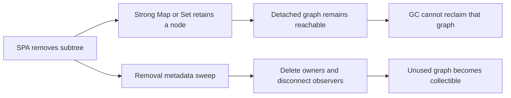

# Candy Android memory ownership investigation

Date: 2026-10-05. GeckoView: `157.0.20260924084938`.
See [the pinned Firefox source comparison](2026-10-05-firefox-android-memory.md).

## Findings and implementation

| Question | Evidence | Result |
| --- | --- | --- |
| Can the selected page remain loaded while its view is released? | Mozilla SessionFeature/EngineViewPresenter; real regular/private Gecko interaction tests | Stop releases ordinary view bindings; Start creates a fresh view for the same GeckoSession. DOM state and document request count survive. |
| Is selected-session protection distinct from visibility? | Mozilla SessionPrioritizationMiddleware | Selected session HIGH; previous session DEFAULT when input-free, otherwise HIGH for at most three minutes. Unknown input receives bounded protection; stale results cannot change current selection. |
| Can a Surface change desynchronize Candy's cached activity state? | Native GeckoView changes activity on Surface acquisition/release | Native setActive is reasserted even if Candy's local Boolean is unchanged. Local effects remain conditional on logical changes. |
| Does failed PiP entry release the hidden view? | Independent review and timeout regression | Release after failed/cancelled PiP transition; confirmed PiP and active presentation stay protected. |
| Are Candy's content scripts retaining detached DOM? | Deterministic before/after tests of the active prototype and Reddit helper | Yes. Removed-node metadata cleanup releases disconnected owners independently of discovery gates and caps. |
| Does Candy's background script retain completed request metadata after port loss? | Deterministic disconnect regression | Yes. Main-frame completion now deletes request metadata before checking the current port. |
| Is the entire parent-process JS footprint Candy's bridge? | Native extension registry matched locally to reporter paths | No. Bundled add-ons and Gecko's own JavaScript are substantial separate owners. |

HIGH_VALUE isolation, history-viewer expiry, foreground warm/idle settings,
background warm-count settings, selected-page retention and private/input/media
guards remain in place. The later immediate-unload policy retires background grace.
Existing automatic Gecko memory-pressure handling is not
replaced by a second host-level pressure bridge.

## Proven JavaScript lifetime bugs

| Reproduction | Before | After | Meaning |
| --- | ---: | ---: | --- |
| 100 protected subtree insert/remove cycles | Ownership entries 2 → 102 | 2 → 2 | A detached key can retain the removed subtree; fixed without extra style/rectangle reads on removal. |
| Reddit root removed after 256 structural tasks | Detached header candidates 1 | 0 | Cleanup remains available after discovery budget exhaustion; detached observers disconnect and styles release. |
| 100 successful main-frame responses after native port loss | First response already retains one entry | Zero after each response | Completed request metadata no longer accumulates during disconnection. |

These are demonstrated retaining paths, not estimates of the historical Pixel
1.4-GiB process group. Native bridge close removes session bindings, cancels
requests/timers, clears delegates and unregisters listeners. Readiness closures
can remain temporarily until ready/failure, bounded by the 15-second deadline.
No additional permanent native-bridge leak was demonstrated by that audit.

## Parent process: native categories and real owners

First successful controlled emulator capture, before DOM churn:

| Parent-process native allocation category | MiB |
| --- | ---: |
| JavaScript, including worker reporters | 87.92 |
| DOM/layout | 3.59 |
| XPConnect infrastructure | 0.73 |
| Graphics | 0.20 |
| Heap not classified by native reporters | 24.72 |
| Remaining explicit native allocations | 25.33 |
| **Explicit native total** | **142.48** |

This is an allocation inventory, not Android physical RAM. It excludes ART
objects and does not include every mapped library, allocator capacity or shared
page. XPConnect is Gecko infrastructure; its size is not Candy bridge ownership.

| Attributable extension owner in that parent capture | MiB |
| --- | ---: |
| uBlock Origin 1.75.0 | 35.22 |
| I still don't care about cookies 1.1.9 | 3.76 |
| Candy Privacy Host | 1.72 |
| Candy Topping Host | 0.72 |
| **Extension ownership subset** | **41.42** |

The extension subset overlaps the native categories above. Do not add it to the
explicit total. Candy Privacy's runtime-message structured-clone holders account
for another identifiable 0.36 MiB outside its background-document realm; a single
snapshot does not establish their lifetime or leakage.

uBlock's notable allocation classes include 12.16 MiB ordinary ArrayBuffer backing,
6.38 MiB WASM linear memory and 4.04 MiB Map allocations. Bundled source uses
compiled filter units, hostname/URL tries and category/token indexes. Typed-array
views over the same backing store are not duplicate buffers. Production Candy
Gecko policy does not forward a second global filter corpus: its user-rule list
is empty in this path; its shared cookie-default asset is only 5,017 source bytes.
No deletion of legitimate add-on filtering structures follows from these data.

Gecko's translation/reader/language-detection worker contributes a measured
16-MiB ArrayBuffer minimum. Pinned `cld-worker.js` explicitly requires that minimum.
It is Gecko CLD2 infrastructure, not a Candy Privacy worker. Remote Settings workers,
shared system-zone strings and JS caches need separate attribution; allocation
class alone cannot identify a Candy binding owner.

## Android ART heap and Pixel metric

The controlled capture's ART HPROF after resume contains one MainActivity, one
BrowserController, two GeckoSession/GeckoViewBrowserSession instances, two privacy
bindings, one CandyGeckoView and ten Bitmap wrappers. The controller has two
resident sessions and one view binding. These counts fit the two-tab workload;
they do not establish leak freedom under every activity/session lifecycle.

A separate read-only Pixel sample of the **regular release app**, not the user's
historical Memory281 workload, gave:

| Process | Android total PSS incl. SwapPss, MiB | SwapPss, MiB | Resident PSS component, MiB |
| --- | ---: | ---: | ---: |
| Main | 267.23 | 197.14 | 70.10 |
| Content 19 | 277.76 | 256.61 | 21.16 |
| Content 28 | 131.80 | 105.71 | 26.10 |
| GPU | 142.65 | 39.90 | 102.75 |
| Utility | 13.40 | 9.99 | 3.40 |
| Crash helper | 4.30 | 1.86 | 2.45 |
| **Process-group total** | **837.15** | **611.20** | **225.95** |

Main-process `dumpsys meminfo` reported 8.25 MiB allocated Dalvik heap and 3.62 MiB
bitmap native allocations. A 256-MiB Dalvik capacity is not 256 MiB of live objects.
This sample cannot quantify the old Memory281 PIDs, which were no longer alive.

memhogs parses Android's `Total PSS by process` section. Android `MemoryInfo.getTotalPss`
adds SwapPss to the resident categories. Therefore the screenshot total alone is
not a measurement of currently resident physical RAM. SwapPss is logical swapped
page attribution, not the physical size of compressed zram. Resident PSS is derived
here from total minus separately reported SwapPss. Source:
[memhogs parser](https://github.com/cicerothoma/memhogs-android/blob/main/app/src/main/java/dev/collinsthomas/memhogs/mem/MeminfoParser.kt),
[Android Debug.java](https://android.googlesource.com/platform/frameworks/base/+/refs/heads/main/core/java/android/os/Debug.java).

## Immediate-unload Pixel follow-up, 16:04–16:10

The newly deployed immediate-unload build keeps main PID 25565 throughout the
user's six screenshots. The displayed process values sum to:

| Time | Main, MiB | Content 28, MiB | Content 30, MiB | GPU, MiB | Utility + crash helper, MiB | Total, MiB |
| --- | ---: | ---: | ---: | ---: | ---: | ---: |
| 16:04:56 | 438.3 | 466.7 | 325.3 | 207.8 | 77.3 | 1,515.4 |
| 16:05:11 | 393.9 | 364.3 | 313.6 | 205.8 | 76.7 | 1,354.3 |
| 16:06:14 | 359.2 | 343.2 | 294.8 | 201.4 | 79.8 | 1,278.4 |
| 16:06:44 | 302.5 | 223.7 | 196.1 | 155.0 | 74.5 | 951.8 |
| 16:09:41 | 287.2 | 225.1 | 193.3 | 157.6 | 74.9 | 938.1 |
| 16:10:44 | 281.0 | 223.0 | 191.3 | 155.4 | 74.9 | 925.6 |

The decrease is 589.8 MiB (38.9%), followed by a plateau. Unchanged process IDs
cannot establish that sessions were retained: a session can close while Gecko
reuses a child process. This run has no matched baseline that isolates the effect
of the immediate-unload change. Screenshot totals alone also cannot divide
resident PSS from SwapPss.

A read-only follow-up around 16:18 confirms that the workload has since changed:
Candy is resumed in the foreground, content PID 25753 is gone, and the active
controller owns exactly one open, active, selected, regular engine session.
There are zero pending memory checks, media-state entries and managed popup
owners; configured background warm count is zero and foreground idle is three
minutes. App logging is disabled, so the four optional background-budget events
cannot reconstruct earlier decisions from this run. A second, destroyed
controller has an empty session map; its presence in an uncollected heap alone
does not establish a retaining path or activity leak.

This later foreground snapshot is not a measurement of the screenshot plateau.
Only structural metadata was retained; the raw ART heap was deleted from both
the device and local storage after inspection.

## Live Memory281 Pixel follow-up, 11:44

The 11:34–11:43 screenshots show the same main, content, GPU and crash-helper
PIDs. Their displayed sum decreases from 1,383.1 to 1,067.6 MiB, a 315.5-MiB
reduction, then remains high. A live read-only sample from that same Memory281
process group, before taking its ART heap snapshot, gives:

| Process | PID | Android total PSS incl. SwapPss, MiB | SwapPss, MiB | Resident PSS component, MiB |
| --- | ---: | ---: | ---: | ---: | ---: |
| Main | 20225 | 363.50 | 0.04 | 363.46 |
| Content 13 | 20717 | 257.72 | 172.95 | 84.78 |
| Content 17 | 21845 | 207.77 | 105.76 | 102.01 |
| GPU | 20649 | 157.25 | 40.46 | 116.79 |
| Utility, restarted since screenshot | 22056 | 43.39 | 18.58 | 24.81 |
| Crash helper | 20460 | 32.64 | 9.08 | 23.57 |
| **Process-group total** | | **1,062.27** | **346.86** | **715.42** |

This sample has much more resident memory than the earlier regular-release
sample. Swap does not explain away the current workload. The main process has
10.87 MiB allocated Dalvik heap and 2.00 MiB of reported bitmap native allocations;
these small subsets do not attribute the remaining engine mappings or memory.

A subsequent `/proc/20225/smaps` inventory, after ART diagnostic collection,
partitions 377.86 MiB of resident PSS as follows. It is a later snapshot and must
not be numerically merged with the preceding table.

| Mapping group | Resident PSS, MiB |
| --- | ---: |
| Explicitly named Gecko jemalloc mappings | 172.85 |
| Other anonymous mappings | 75.41 |
| APK mappings | 58.17 |
| ART/Dalvik mappings | 35.06 |
| Other named mappings | 32.29 |
| Shared-library mappings outside APK mappings | 4.08 |

Mapping names identify allocator/mapping ownership, not particular live JS
objects. Gecko jemalloc pages can contain live allocations, allocator capacity
and reusable pages; their entire PSS is not a demonstrated Candy binding leak.
The large anonymous/engine footprint needs a native reporter capture of this
specific workload for finer ownership attribution. ART object counts alone
cannot provide that answer.

The same live controller's ART snapshot confirms:

| State | Observed value |
| --- | --- |
| App backgrounded / background budget applied / UI images trimmed | All true |
| Configured unselected warm tabs / grace / foreground idle | 0 / 30 seconds / 3 minutes |
| Resident session map | 2: one selected, one unselected; both inactive and open |
| GeckoView bindings / CandyGeckoView instances | 0 / 0 |
| Pending memory checks / previews / media-state entries | 0 / 0 / 0 |
| Private tabs, media presentation, pending file/permission/auth flows, managed popup ownership | None observed |

The second session is therefore still owned by Candy, rather than established
to be an empty Gecko process reserve. Its saved native state contains a form
entry. This does not establish user interaction, the result of the earlier
direct form query, the particular page, or why its eviction was skipped.
The native form query's result is not stored; unknown or stale results also
retain a session. Background checks currently retry only on a subsequent
relevant trigger, unlike the periodic foreground idle sweep.

Gecko's direct `containsFormData` actor collects persistable form state and
filters it for privacy; it does not require a trusted user event. In particular,
the direct collector includes a single-select dropdown even with its unchanged
default. Programmatically changed nonempty text also qualifies. The session-state
collector is a different path and omits unchanged single-select defaults.
Consequently, a saved form entry cannot prove the previous direct query's answer.
Sources: [GeckoView actor](https://github.com/mozilla-firefox/firefox/blob/FIREFOX_157_0_RELEASE/mobile/shared/actors/GeckoViewContentChild.sys.mjs#L192-L201),
[direct form collector](https://github.com/mozilla-firefox/firefox/blob/FIREFOX_157_0_RELEASE/toolkit/components/sessionstore/SessionStoreUtils.cpp#L795-L930),
[session-state collector](https://github.com/mozilla-firefox/firefox/blob/FIREFOX_157_0_RELEASE/toolkit/components/sessionstore/SessionStoreUtils.cpp#L617-L696).

Three real GeckoView fixtures independently confirm this distinction:

| Untouched fixture | Authenticated trusted-input probe | Native `containsFormData` | Combined Candy protection |
| --- | --- | --- | --- |
| Input-free page | false | false | false |
| Single select with markup-default selected second option | false | true | true |
| Text input assigned a nonempty value by page JavaScript | false | true | true |

There was no simulated or physical user input in these three fixtures.
Native protection was not weakened: programmatic/restored form state can still
be valuable even when the trusted-input probe reports no user interaction.

The `_disable_art_image_` process suffix disables loading Android's ART app
image for Gecko child startup. It does not identify a web-image cache.
Content, GPU, utility and crash-helper processes have distinct jobs; their
names do not establish that they are safe to terminate. The selected live DOM
needs its content process. Gecko's unused-process reserve and preallocation
are separate from live session ownership, and their release does not close a
session with real browser/worker keepalives.
Sources: [manifest template](https://github.com/mozilla-firefox/firefox/blob/FIREFOX_157_0_RELEASE/mobile/android/geckoview/src/main/AndroidManifest_overlay.jinja#L6-L8),
[unused-process shutdown policy](https://github.com/mozilla-firefox/firefox/blob/FIREFOX_157_0_RELEASE/dom/ipc/ContentParent.cpp#L2115-L2149).

Only structural counts, Booleans, settings and numeric memory totals were
recorded from this live heap. No page URLs or input values were published.
The raw HPROF was removed from both the phone and local temporary storage.
No forced-GC flag was used, so unrooted wrapper counts are not leak evidence.

An independent input-probe defect was also reproduced: HTTP/HTTPS-owned
`srcdoc` and `blob` frames had no query listener and conservatively retained
their sessions. The input probe now has its own origin-fallback registration
and listener, while other privacy content scripts keep their previous scope.
Late-injected empty `about:blank` remains unknown. This fix does not override a
positive native form result and is not proof that the live Pixel's unselected
session will be released.

## Background scheduling follow-up

The session-unload operation works in controller/native Gecko tests, but this
does not establish reliable execution after 30 seconds in a genuinely cached
Android process. `backgroundMemoryTrim` uses a single `Handler.postDelayed`;
`TRIM_MEMORY_UI_HIDDEN` releases UI resources but does not apply the session
budget. Android's documented cached-app freezer can suspend all threads about
10 seconds after entering the cached state on Android 14+. GC and delayed
callbacks cannot run while frozen. Android also discourages relying on Activity
work after `onStop` in a cached process.
Sources: [cached-app freezer](https://source.android.com/docs/core/perf/cached-apps-freezer),
[Android 14 cached-process execution](https://developer.android.com/about/versions/14/behavior-changes-all#cached-resource-usage).

| Path | Current limitation | Safe corrective direction |
| --- | --- | --- |
| 30-second background Handler | Can be suspended before its deadline | Prepare safe eviction decisions during active lifecycle; do not promise a cached-process deadline or add a service solely to keep the timer alive |
| Unknown/stale input response | Pending entry is removed; no background retry is scheduled | Bounded identity-safe retry after transient failures/readiness, preserving unknown protection |
| Native form query never completes | No Candy-owned deadline for the native stage; pending entry blocks further queries | Request-scoped deadline and stale-response rejection; never interpret timeout as no form data |
| Native positive form state | May include untouched dropdowns/programmatic values | Distinguish form state from trusted interaction before revising retention policy |

These are source-supported limitations of the previously deployed policy, not an established cause for every
Pixel screenshot. The live snapshot's applied-budget flag proves a check did
start during that background interval. It neither proves a 30-second deadline
nor a successful eviction. The following implementation replaces that policy;
the old Pixel and controlled captures above/below predate this change.

## Immediate background unload implementation

| Concern | Current implementation |
| --- | --- |
| Timing | Full app-background transition starts the budget immediately after visibility/view release; no 30-second Handler or grace setting remains |
| Eligibility | Selected session, private tabs and media/PiP/prompt/login owners remain protected; background warm quota remains configurable, default zero |
| Form defaults | Gecko background checks use authenticated trusted user input directly; native form state supplied by the page no longer keeps an otherwise clean session loaded |
| Actual or uncertain input | Confirmed trusted input retains the session. Unknown/timeouts receive at most three attempts, each with a 2-second controller deadline and 250-ms retry delay; unresolved input remains protected |
| Async identity | Each attempt has a distinct object identity plus lifecycle, session, navigation, document and access snapshots; an old reply cannot complete a newer retry on the same session |
| Cancellation | Foreground return, settings changes, navigation/session close and destruction remove pending deadlines/retries |
| Resume | Existing snapshot-and-close path preserves eligible regular native history/state. Foregrounding alone does not recreate evicted tabs; selection/use creates a new session and restores state |
| Diagnostics | Opt-in app logs emit fixed budget-applied, unloaded, input-protected and input-unknown events; no URLs, tab IDs or form values |

Foreground idle eviction retains its native form-data guard. Background page
reconstruction intentionally does not retain arbitrary JavaScript state;
programmatically supplied form state can be saved without keeping the live page.
Private pages remain memory-only and are not evicted by this policy.
Empty `about:blank` or unreachable frames can still make the trusted-input
result unknown and keep a session resident. Android can suspend work early;
bounded retries reduce the timing exposure, not provide a hard platform deadline.

The earlier baseline/fixed memory pair compares JS lifetime and lifecycle fixes,
not this later immediate-unload policy. No RAM reduction from this new policy is
claimed from those measurements.

The new policy was built and installed with `candy-device-deploy` as
`dev.sk2andy.materialbrowser.memory281` / **Candy Memory 281** on the Pixel.
Installation preserved app data; launch succeeded and the main PID was 25565.
The measurement workload must be reopened after the APK update before comparing
background memory: process restart and an initially cold tab set are not a
matched before/after memory benchmark.

| Immediate-unload verification | Result |
| --- | --- |
| Full/Foss JVM | 1,857 per flavor; no failures/errors/skips |
| Full/Foss lint and APK assembly | Passed |
| Controller immediate unload, timeout/retry, stale/cancel/quota/private/media/UI contracts | 29 Android cases passed |
| Native input protection and inherited frames | 18 Android cases passed |
| Native eviction → foreground still cold → selection restores history and Back | 1 Android case passed |
| Developer UI and bounded/legacy-compatible settings storage | 3 Android cases passed |
| Independent ownership/style review | No new P1/P2 findings |
| Pixel installation and launch | Passed, same app ID and data retained |

These 51 distinct Android cases used two separate agent-owned API-37 emulators;
neither agent used the Pixel. Initial fixture failures were corrected with
observable native-history/presentation, caret-position and in-flight callback
synchronization, then rerun successfully. Production assertions were preserved.
No strict cached-process execution deadline or RAM reduction is inferred from
these functional tests.

## Capture method and interpretation limits

`GeckoNativeMemoryCaptureInstrumentedTest` is opt-in and uses isolated regular
fixtures. It writes native FIFO reports to app-private cache, captures Android
memory separately and takes ART HPROF last. Raw reports can contain URLs and
notable strings; they remain local temporary diagnostics, not tracked artifacts.
The summarizer emits category/ownership totals without raw report paths or URLs.
Ownership subsets overlap; RSS sums double-count shared pages and are not PSS.

Native about:memory Save fails in this pinned GeckoView before Android fallback
because its file picker lacks `appendFilter`. Diagnostic FIFO startup is enabled
only in the dedicated profile; no production JS bridge was added.

Cold-profile captures showed add-on installation/filter initialization overlapping
the measurement window. uBlock appeared only after the first snapshot and reached
104 MiB. Those snapshots prove ownership/startup costs, not a fix-induced RSS
change. An earlier after-resume capture also used a unique native filename ending
`.json-1.gz`; the initial harness rejected it. Stale outputs must not be treated as
new samples. Final capture results and warm-up checks are recorded below.

## Final controlled baseline/fixed pair

Both APKs used the same dedicated API-37 emulator, existing Gecko profile,
bundled add-ons and identical test APK. Each run warmed for 60 seconds, executed
100 DOM insert/remove cycles, actually navigated Home for 60 seconds, returned
to the same selected fixture, and captured a separate native minimize-memory
report. Both instrumentation runs passed. Every report's exact Main Process PID
matches its run; none of the earlier failed or stale captures enters this pair.
The fixture preserves its title across backgrounding but does not assert that
Candy acquired ownership of each inserted header.

[Sanitized capture data and APK hashes](2026-10-05-candy-memory-captures.json)
contain numeric category totals without raw URLs, strings or extension origins.

| Main process, MiB | Baseline before churn | Baseline background 60 s | Baseline after minimize | Fixed before churn | Fixed background 60 s | Fixed after minimize |
| --- | ---: | ---: | ---: | ---: | ---: | ---: |
| Native explicit allocations | 146.03 | 120.90 | 122.59 | 147.32 | 122.84 | 124.38 |
| JavaScript, including workers | 83.42 | 75.31 | 75.90 | 84.59 | 77.64 | 78.16 |
| Heap-unclassified allocation inventory | 26.83 | 20.78 | 21.68 | 26.29 | 20.30 | 21.09 |
| Extension ownership subset, overlaps above | 29.36 | 27.90 | 28.00 | 29.26 | 28.09 | 28.15 |

| Content process allocations, MiB | Baseline before churn | Baseline after churn | Baseline background 60 s | Baseline after minimize | Fixed before churn | Fixed after churn | Fixed background 60 s | Fixed after minimize |
| --- | ---: | ---: | ---: | ---: | ---: | ---: | ---: | ---: |
| Explicit | 34.24 | 60.49 | 32.40 | 33.42 | 34.37 | 60.73 | 31.78 | 32.59 |
| Orphan DOM, overlapping subset | 0.00 | 7.98 | 0.08 | 0.08 | 0.00 | 8.07 | 0.08 | 0.08 |

Already the baseline reclaims most of this fixture's orphan DOM during a real
background interval. The added minimize-memory capture changes baseline parent
explicit memory from 122.29 to 122.59 MiB and fixed from 124.01 to 124.38 MiB;
parent JS is unchanged. A forced collection is not a demonstrated additional
large saving here. After-minimize Android PSS is 331.36 MiB baseline versus
328.56 MiB fixed, including diagnostic parser overhead and zero reported swap.
This small difference from one sequential pair is not a reliable performance
gain. Native explicit inventory and Android PSS must not be subtracted to
derive a missing-object category.

| Fixed main process before first native dump: Android PSS categories | MiB |
| --- | ---: |
| Java heap PSS | 16.56 |
| Native heap PSS | 17.10 |
| Code | 35.19 |
| Stack | 3.27 |
| Graphics | 0.00 |
| Private other, not attributed by mapping in this capture | 157.37 |
| System/proportionally shared allocations | 93.75 |
| **Total PSS, no swap** | **323.23** |

These Android categories partition this snapshot, unlike the overlapping native
ownership subsets. Native Gecko allocations are not all covered by Android's
native-heap category or `Debug.getNativeHeapAllocatedSize()`. A small ART heap
therefore does not imply a small engine process.

The final ART HPROF shows one MainActivity, one BrowserController, one privacy
runtime, two GeckoSession/session wrappers, one active view binding, no pending
preview captures and no media-state entries in both variants. Baseline has three
CandyGeckoView wrappers and twelve Bitmap wrappers; fixed has two and ten.
Wrapper counts do not prove that all wrappers are bound or measure retained
native pixel memory. This is an object inventory, not a dominator/retaining-path
proof or a long-duration lifecycle leak test.

Warm baseline's stable identified owners include uBlock's full origin-attributed
subtrees at 23.95 MiB after minimize, CLD2 at 17.35 MiB (including its 16-MiB
buffer), Safe Browsing prefix sets at 12.29 MiB, immutable JS string cache at
8.08 MiB and the cookie add-on at 2.76 MiB. The Remote Settings startup worker
is absent. Shared-zone strings total about 3.74 MiB and expose only non-notable
strings, so no further named-string ownership is assigned. These rows use
different ownership/reporting scopes and must not all be added to extension or
JavaScript totals.

| Identified ownership after minimize, MiB | Warm baseline | Warm fixed |
| --- | ---: | ---: |
| uBlock full origin-attributed subtree | 23.95 | 24.10 |
| Cookie add-on full origin-attributed subtree | 2.76 | 2.74 |
| Candy Privacy background ownership | 0.89 | 0.91 |
| Candy Topping background ownership | 0.40 | 0.40 |
| CLD2 worker, distinct Gecko owner | 17.35 | 17.35 |
| XPConnect infrastructure, distinct scope | 0.33 | 0.33 |

Candy's two background hosts account for about 1.31 MiB in the fixed warm
parent. This excludes its content scripts in page processes and messaging
storage outside those background origins. It is not a measurement of all Candy
features or an absolute upper bound on Candy-related JavaScript memory.

The earlier cold run's 284-MiB JS footprint contained a disjoint partition of
104.11 MiB uBlock zones, 29.48 MiB uBlock-serialized system strings, 33.77 MiB
Remote Settings worker, 17.36 MiB CLD2 worker, 32 MiB main nursery, 1.01 MiB
Candy host JS, 2.60 MiB cookie add-on JS and 63.66 MiB remaining JS. uBlock
serializer signatures identify those system strings; two equal-content copies
account for a 27.59-MiB subset. Its bundled cache writer serializes entries and
writes fast cache and extension storage concurrently. This is concrete data
provenance, not a proven persistent leak. The warmed captures do not exhibit
that large startup footprint; because these are different process runs, that
does not alone prove which precise roots a GC released.

No equal-workload Firefox device benchmark was completed. The historical
Memory281 Pixel processes had exited before collection. These captures cannot
assign every byte in the user's old 1.4-GiB group or demonstrate a large reduction
for that workload. The demonstrated JS lifetime fixes stand on their independent
ownership regressions; further attribution of a recurring Pixel spike requires
a native dump and resident/swap breakdown from that same live process group.

## Verification

| Check | Result |
| --- | --- |
| Full JVM | 1,857 passed, no skips/failures/errors |
| Foss JVM | 1,857 passed, no skips/failures/errors |
| Full/Foss lint | Passed |
| Full/Foss APK assembly | Passed |
| All Gecko JS suites | 287 passed |
| Native JSON/gzip/category summarizer | 15 passed |
| Opt-in native baseline/fixed capture | Both passed; 10 exact-parent-PID-validated reports, two ART HPROFs |
| Background controller policies and wiring | 26 Android tests passed |
| Failed/confirmed PiP transition regressions | 2 Android tests passed |
| Real regular/private Gecko plus System WebView interaction | 3 Android tests passed |
| Native and actual DOM form protection | 7 Android tests passed |
| Actual background audio | 1 Android test passed |
| Inherited-frame input checks and real controller eviction/protection | 8 Android tests passed |
| Native form state versus trusted user interaction | 3 Android tests passed |
| Privacy-host profile-preserving upgrade | Direct install-r, same Gecko profile: host 1.5.63 → 1.5.64; 8 frame/controller cases passed |
| Independent ownership/correctness review | Findings addressed |

Thirty-nine distinct lifecycle Android tests used the implementation agent's own
API-37 emulator. Four initial cases were blocked by a SystemUI ANR dialog; the
same cases passed after closing that dialog. Pixel was not used by another agent.
Real Gecko tests preserve the same native session, create a new view, keep DOM
click counters and pixels correct after 31 seconds hidden, make exactly the two
original document requests, and do not persist private page/session data.
