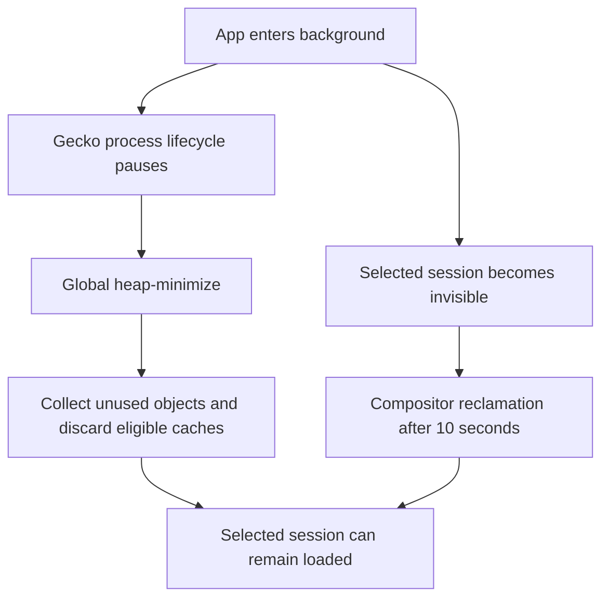

# Firefox Android memory management compared with Candy

Reviewed on 2026-10-05 against Mozilla's `FIREFOX_157_0_RELEASE` sources. Candy uses
GeckoView `157.0.20260924084938`. This aligns the major version; it is not a claim
that the installed applications have identical builds or effective preferences.
No equal-workload Firefox/Candy device benchmark was performed. The follow-up
implementation releases ordinary Gecko view bindings while hidden, retains the
selected session, separates selected-session priority from visibility, and
reasserts native activity after view replacement. Device validation is recorded
below as it completes.

## Conclusion

Keeping the selected tab does not require retaining all its graphics and cache
resources. Firefox's Android host explicitly disables automatic engine-session
suspension under memory pressure and relies on GeckoView and Android reclamation.
Candy inherits the same native reclamation machinery and additionally closes
eligible unselected sessions after its background grace period. Retaining the
selected tab alone therefore does not establish the cause of Candy's RAM plateau.
[Firefox Core](https://github.com/mozilla-firefox/firefox/blob/FIREFOX_157_0_RELEASE/mobile/android/fenix/app/src/main/java/org/mozilla/fenix/components/Core.kt)

## Shared native reclamation

| Trigger | Result | Primary source |
| --- | --- | --- |
| Process lifecycle pauses | Gecko broadcasts `application-background` and `memory-pressure: heap-minimize`. | [GeckoRuntime](https://github.com/mozilla-firefox/firefox/blob/FIREFOX_157_0_RELEASE/mobile/android/geckoview/src/main/java/org/mozilla/geckoview/GeckoRuntime.java), [nsAppShell](https://github.com/mozilla-firefox/firefox/blob/FIREFOX_157_0_RELEASE/widget/android/nsAppShell.cpp) |
| Session becomes inactive | Flush session state; request compositor memory reclamation after 10 seconds. Reactivation cancels the pending request. This is separate from global JavaScript collection. | [GeckoSession](https://github.com/mozilla-firefox/firefox/blob/FIREFOX_157_0_RELEASE/mobile/android/geckoview/src/main/java/org/mozilla/geckoview/GeckoSession.java) |
| Global `heap-minimize` | Run shrinking garbage collection and cycle collection; live referenced objects can remain. | [nsJSEnvironment](https://github.com/mozilla-firefox/firefox/blob/FIREFOX_157_0_RELEASE/dom/base/nsJSEnvironment.cpp) |
| Global memory pressure | Evict cached history document viewers. Navigation history and the current document are distinct from those cached viewers. | [nsSHistory](https://github.com/mozilla-firefox/firefox/blob/FIREFOX_157_0_RELEASE/docshell/shistory/nsSHistory.cpp) |
| Global memory pressure | Discard eligible decoded image surfaces, excluding locked surfaces; remove unused encoded image cache entries. | [SurfaceCache](https://github.com/mozilla-firefox/firefox/blob/FIREFOX_157_0_RELEASE/image/SurfaceCache.cpp), [imgLoader](https://github.com/mozilla-firefox/firefox/blob/FIREFOX_157_0_RELEASE/image/imgLoader.cpp) |
| Global memory pressure | Purge the in-memory network cache; this is not deletion of cookies or browsing history. | [CacheObserver](https://github.com/mozilla-firefox/firefox/blob/FIREFOX_157_0_RELEASE/netwerk/cache2/CacheObserver.cpp) |
| Android trim callback | Native `MemoryController` translates BACKGROUND-or-higher levels, and RUNNING_CRITICAL, into pressure notifications. Repeated noncritical full notifications are limited to one per 10 seconds. UI_HIDDEN alone is ignored here. | [MemoryController](https://github.com/mozilla-firefox/firefox/blob/FIREFOX_157_0_RELEASE/mobile/android/geckoview/src/main/java/org/mozilla/gecko/process/MemoryController.java) |

`GeckoRuntime.create()` registers both native Android memory callbacks and its
process-lifecycle listener. Candy uses that API with the application context and
does not disable low-memory detection. Its activity-level cache trimming does not
need to manually duplicate Gecko's notifications.

## Application integration differences

| Concern | Firefox Android 157 | Candy at review time | Interpretation |
| --- | --- | --- | --- |
| Automatic host suspension | `trimMemoryAutomatically = false`. The Android Components implementation exists but is not enabled by Fenix. | Default background warm count 0 after 30 seconds; selected, private and protected sessions remain. | Candy's host policy is already more aggressive for eligible sessions. |
| View ownership | `SessionFeature` stops its presenter, which releases the engine-view session binding. | Follow-up releases ordinary view bindings on Stop/background, blocks synchronous reattachment, and permits a fresh view on Start. Selected session remains loaded; active media presentation is exempt. | A retained wrapper alone does not prove retained GPU allocations. [Presenter](https://github.com/mozilla-firefox/firefox/blob/FIREFOX_157_0_RELEASE/mobile/android/android-components/components/feature/session/src/main/java/mozilla/components/feature/session/engine/EngineViewPresenter.kt) |
| Session priority | Selected session HIGH. Previous session without form data DEFAULT; with form data HIGH temporarily, then DEFAULT after 3 minutes. | Follow-up implements native priority independently of visibility; unknown form state receives the same bounded protection. Close cancels expiry; selection/navigation generations reject stale results. | Priority influences process protection, not an explicit cache flush or guaranteed RAM reduction. [Middleware](https://github.com/mozilla-firefox/firefox/blob/FIREFOX_157_0_RELEASE/mobile/android/android-components/components/browser/state/src/main/java/mozilla/components/browser/state/engine/middleware/SessionPrioritizationMiddleware.kt) |
| Form protection | Form checks participate in priority management. | Both confirmed input and an unknown input-check result prevent optional eviction. | Record the actual exemption reason; the screenshots do not establish it. |
| Native memory/cache tuning | Runtime builder contains no explicit low-memory-detection override or BFCache-limit tuning. | Native defaults retained; configured history-viewer expiry added. | No missing Firefox-specific low-memory switch found. [GeckoProvider](https://github.com/mozilla-firefox/firefox/blob/FIREFOX_157_0_RELEASE/mobile/android/fenix/app/src/main/java/org/mozilla/fenix/gecko/GeckoProvider.kt) |

Candy source entry points: `BrowserController.onAppBackgrounded`,
`trimMemoryResidentSessions`, `protectedResidentTabIds`,
`GeckoViewRuntimeHandle.setActive`, `createView`, `releaseView`,
`GeckoRuntimeSettingsFactory`, and `GeckoHistoryCacheConfig`.

## Isolation and process-count cautions

Fenix's manifest baseline uses isolation strategy 0 for Release/Beta and 2 for
Nightly/Developer. Candy explicitly uses HIGH_VALUE (2), as requested. Gecko 157
defaults Fission to enabled; the strategy can therefore affect process allocation.
Firefox experiments or persisted preferences can change effective settings. This
configuration difference is not evidence of a particular RAM saving.
[Fenix feature defaults](https://github.com/mozilla-firefox/firefox/blob/FIREFOX_157_0_RELEASE/mobile/android/fenix/app/nimbus.fml.yaml),
[Gecko static defaults](https://github.com/mozilla-firefox/firefox/blob/FIREFOX_157_0_RELEASE/modules/libpref/init/StaticPrefList.yaml)

Gecko Android deliberately retains an empty web process and enables prelaunch.
A remaining `tab_disable_art_image_N` process therefore does not, by itself,
establish that another browser tab remains loaded.
[GeckoView preferences](https://github.com/mozilla-firefox/firefox/blob/FIREFOX_157_0_RELEASE/mobile/android/app/geckoview-prefs.js)

## Remaining evidence needed

| Question | Required observation |
| --- | --- |
| Did native background reclamation run in the reported workload? | Process-lifecycle and native memory-pressure traces for that run. |
| Did all hidden sessions remain inactive? | Correlate controller selection, local active state, native activity and Surface attach/destroy events. Native GeckoView can change activity independently of Candy's cached boolean; no failing sequence has been reproduced. |
| What owns the large content-process allocation? | A Gecko native memory report separating JavaScript, images, BFCache, graphics, allocator overhead and other categories; PSS alone cannot classify these. |
| Why was a second session retained? | Exemption/input-check outcomes tied to the current navigation generation, without logging user input. |
| Is Firefox smaller for this workload? | Same URLs, navigation history, interactions, background duration, engine version and relevant settings; sum PSS across each application's complete process group. |

The present source comparison supports retaining the selected tab while investigating
resource reclamation. It does not justify disabling HIGH_VALUE isolation or claiming
that closing the selected tab is necessary to match Firefox's memory behavior.
