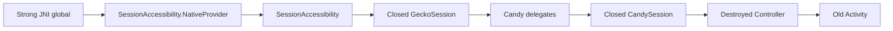
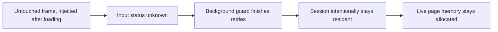
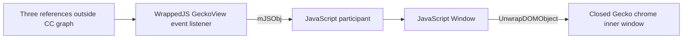

# Background memory investigation — 2026-10-06

Baseline: `801cb758` (`perf(browser): Manage resident Gecko sessions and preview memory`).
The checkpoint precedes this investigation; the unrelated untracked address-bar docking test was excluded.
The commit's pre-commit hook ran staged whitespace validation, 115 JavaScript tests and the Python memory-summary suite.

## Questions and measurement boundaries

| Question | Required evidence |
| --- | --- |
| Does background eviction actually run? | Real ProcessLifecycle STOP, applied budget, resident maps, completed guards and released views |
| Is a closed Java session still owned? | Strong GC-root path, correct primitive/reference decoding and exclusion of weak referents |
| Is retention durable? | Repeated close cycles, time-separated observations and distinct Java-GC/native-GC controls |
| What accounts for process memory? | Entire process-group PSS and swap; Gecko allocation reports, ART objects, bitmap and GPU allocations |
| Is a change effective? | Same workload before/after; count session reloads and preserve foreground defaults and private boundaries |

Plain HPROF pauses threads and allocates report data; it does not request Java GC. `am dumpheap -g` requests
Java GC/finalization, not Gecko JS GC/CC. Native `memory report` is observational but touches/allocates memory;
`minimize memory report` deliberately performs three shrinking-GC/CC rounds and allocator purging.
The untouched series must precede these interventions.

Android `Debug.MemoryInfo.getTotalPss()` includes SwapPss. The contained swap figure must not be added again.
A resident PSS approximation subtracts SwapPss. `/proc/PID/smaps_rollup` Pss excludes swap. RSS sums count shared
mappings repeatedly. These definitions are not interchangeable.
[AOSP Debug](https://android.googlesource.com/platform/frameworks/base/+/94b4c163b7dfe5ce3607f7bb8456f9573f7de57d/core/java/android/os/Debug.java#425),
[ART HPROF](https://android.googlesource.com/platform/art/+/b753cf97923c3695338d21466fa14c57b480a59a/runtime/hprof/hprof.cc#1624),
[Gecko minimizer](https://github.com/mozilla-firefox/firefox/blob/fdd757a2e09c9471cddf383e64e631e4ce178499/xpcom/base/nsMemoryReporterManager.cpp#L2768).

## Pixel evidence

Pixel 11 Pro: Android 17 / API 37, `google/grizzly/grizzly:17/CD1A.260905.001.B1/16238327:user/release-keys`.
App: `dev.sk2andy.materialbrowser.memory281`. Screenshots at 09:29 and 09:45 show the same six PIDs.
Their rounded sum changes 1237.2 → 1231.0 MiB: 6.2 MiB, approximately 0.5%. This is a plateau, not proof of a leak.

A later 09:50 process-group sample, collected before the Java heap dump:

| Role / PID | Android TOTAL incl swap, MiB | Contained SwapPss, MiB | Resident PSS approximation, MiB |
| --- | ---: | ---: | ---: |
| Parent 18090 | 388.85 | 0.04 | 388.82 |
| Content 18518 | 244.03 | 178.93 | 65.11 |
| Content 20803 | 249.98 | 0.04 | 249.94 |
| GPU 18506 | 167.64 | 35.24 | 132.40 |
| Utility 20967 | 42.00 | 19.73 | 22.27 |
| Crash helper 18249 | 31.74 | 9.35 | 22.39 |
| **Group** | **1124.25** | **243.33** | **880.92** |

These sequential samples are a process-group approximation, not an atomic snapshot. SwapPss represents
logical uncompressed swapped pages, not their compressed physical zRAM size. The later workload is not
asserted identical to either screenshot.

Parent ART allocated heap: 12736 KiB (12.44 MiB), versus 388.85 MiB Android TOTAL. Its Android Unknown mapping
category is 246509 KiB; 53 native bitmap allocations total 14967 KiB. These mapping classifications do not
identify SpiderMonkey owners. No native Gecko report was available on this running Pixel: its startup FIFO
was disabled. Therefore the Pixel parent Unknown category cannot yet be divided precisely into JS/DOM/cache
allocations. Small Java wrappers can nevertheless retain larger native allocations.

### Actual residency and ownership

The valid 54,601,561-byte plain HPROF shows:

| State | Value |
| --- | --- |
| Current controller | Background=true; Activity started/resumed=false; budget applied=true |
| Settings | Foreground limit 10; idle 3 min; background unselected budget 0 |
| Resident sessions | 2 regular sessions: 1 selected, 1 unselected |
| GeckoView bindings / pending memory guards | 0 / 0 |
| Pending captures / media states / permission grants / transient or federated popup sets | 0 |
| Native GeckoSession / CandySession wrappers | 5 / 5; 3 closed, 2 open |
| Controllers / Activities | 2 / 2; one controller destroyed |

The extra open session is retained rather than evicted. No visible private/media/prompt guard explains it;
the remaining input protection permits either actual tracked input or an unknown result. The completed
result was not stored and application logging was disabled: this snapshot cannot distinguish those two
outcomes. It must not be labeled an about:blank case solely from these counts.

Two independent decoders validate all instance payload lengths against inherited field layouts.
Three closed native sessions have `mWindow=null`; their NativeProviders have nonzero native handles,
`attached=true`, `view=null`, and strong JNI roots. One reaches the destroyed controller and old Activity:

ART visits JNI globals as strong roots; its weak JNI globals are a separate GC traversal.
[ART JavaVMExt](https://android.googlesource.com/platform/art/+/b753cf97923c3695338d21466fa14c57b480a59a/runtime/jni/java_vm_ext.cc#1214).
This proves strong retention at capture time. It does not yet prove its duration or the native byte total.

An offline edge-removal counterfactual clears Candy's native delegate handlers and session-local extension
message delegates for the three closed sessions. The old controller and Activity then become unreachable,
while the current controller and Activity remain reachable. 29358 previously strong reachable graph nodes
lose reachability. This is a graph simulation, not a measured byte reduction or a deployed fix.

### Invalid second Pixel capture

At 10:00:49.857 Android killed parent 18090 with reason `excessive cpu 7960 during 300063 ... limit=2`.
This occurred during the second plain heap dump. The incomplete 8,809,514-byte file was excluded and deleted;
the planned `-g` capture never ran. Heap collection may have contributed to this CPU limit. Process death
is not counted as successful natural memory reclamation. Subsequent controls use isolated emulators.

## Exact Gecko and Firefox source comparison

Candy resolves `org.mozilla.geckoview:geckoview:157.0.20260924084938`. The AAR's own buildconfig identifies
Hg changeset `8eb25af4acf031ab1e06abf1a912275083c820ed` on mozilla-release. Nineteen relevant source files match
Git commit `fdd757a2e09c9471cddf383e64e631e4ce178499` (`FIREFOX_157_0_RELEASE`) byte-for-byte.

| Mechanism | Verified source behavior |
| --- | --- |
| Firefox host | Fenix configures EngineMiddleware with automatic trim disabled. Ordinary view release preserves EngineSession. |
| Gecko process background | ProcessLifecycle ON_PAUSE emits application-background and heap-minimize. |
| Inactive selected session | setActive(false) flushes state and schedules compositor pressure after 10 s; it does not close the document. |
| Process pool | Android keeps 1 ordinary web process and 1 extension process alive by default; PID count is not loaded-tab count. |
| Prelaunch | Native Android Fission reserve count 1. Since 150 Java runtime creation does not immediately preload a child; explicit warmUp does. |
| Memory API | Actual 157 AAR has no public GeckoRuntime getMemoryInfo/getMemoryController/minimizeMemoryUsage method. |
| Isolation | Fenix Release/Beta baseline strategy 0; Candy explicitly uses requested HIGH_VALUE 2. Experiments can alter Fenix's effective configuration. |

[Firefox Core](https://github.com/mozilla-firefox/firefox/blob/fdd757a2e09c9471cddf383e64e631e4ce178499/mobile/android/fenix/app/src/main/java/org/mozilla/fenix/components/Core.kt#L409),
[Gecko background](https://github.com/mozilla-firefox/firefox/blob/fdd757a2e09c9471cddf383e64e631e4ce178499/widget/android/nsAppShell.cpp#L149),
[Gecko process defaults](https://github.com/mozilla-firefox/firefox/blob/fdd757a2e09c9471cddf383e64e631e4ce178499/mobile/android/app/geckoview-prefs.js#L164).

Source-level NativeProvider hypothesis: GeckoViewSupport.Close nulls mWindow before ForceClose, whereas its
destructor calls DetachNatives only when mWindow is nonnull. SessionAccessibility holds a strong Java GlobalRef;
normal native detach would clear its native handle asynchronously. This route may explain the observed roots;
Java graph evidence alone cannot prove that exact native route or attribute the whole memory plateau to it.
[Close](https://github.com/mozilla-firefox/firefox/blob/fdd757a2e09c9471cddf383e64e631e4ce178499/widget/android/nsWindow.cpp#L1908),
[Destructor](https://github.com/mozilla-firefox/firefox/blob/fdd757a2e09c9471cddf383e64e631e4ce178499/widget/android/nsWindow.cpp#L1821),
[Native GlobalRef](https://github.com/mozilla-firefox/firefox/blob/fdd757a2e09c9471cddf383e64e631e4ce178499/accessible/android/SessionAccessibility.h#L111).

## Controlled many-tab emulator investigation

The opt-in `GeckoManyTabMemoryCaptureInstrumentedTest` uses 20 fresh local documents, each with a 12 MiB touched
JS buffer, 2500 DOM rows and four decoded 512×512 PNGs. It keeps production defaults 10 / 3 min / BG0, uses real Home
navigation and captures natural 5/30/120/300 s phases before GC controls. Four warm 10 / background 30 s cycles
separate transient peaks from accumulation. A second workload adds an untouched about:blank iframe per page.
Strong test references must not own closed sessions or views: only weak references and numeric identities
cross phase boundaries. Native report JSON attribution occurs offline, after Android sampling.

Instrumentation keeps the process at ActivityManager foreground-service state / oomAdj 0 despite real
ProcessLifecycle CREATED. It therefore exercises Candy/Gecko lifecycle and unloading, not ordinary Android
cached/freezer/LMK behavior. Emulator graphics, RAM and pages differ from the Pixel retail-page workload.
Absolute RAM figures cannot be presented as a direct Firefox/Pixel benchmark.

Raw Pixel/emulator heaps and native reports stay in restricted temporary directories; only structural
ownership paths and sanitized numeric summaries belong in the repository. No URLs, input values or private
session data may be exported into this audit.

### Natural series and repeated cycles

All memory figures below are MiB. Resident PSS is the sum of `smaps_rollup/Pss`; swap is separate.
The instrumentation workload uses an API 37 emulator with approximately 4 GiB RAM.

| Stage | Resident sessions | Resident PSS | SwapPss | Document requests |
| --- | ---: | ---: | ---: | ---: |
| Foreground, after 20 pages | 10 | 1687.4 | 162.2 | 20 |
| Background 5 s | 1 | 870.2 | 86.2 | 20 |
| Background 30 s | 1 | 743.9 | 84.5 | 20 |
| Background 120 s | 1 | 738.6 | 84.2 | 20 |
| Background 300 s | 1 | 735.9 | 84.0 | 20 |
| Cycle 1, background 30 s | 1 | 749.3 | 83.0 | 29 |
| Cycle 2, background 30 s | 1 | 754.8 | 83.0 | 38 |
| Cycle 3, background 30 s | 1 | 762.6 | 82.9 | 47 |
| Cycle 4, background 30 s | 1 | 776.0 | 82.9 | 56 |
| After plain Java HPROF | 1 | 797.8 | 82.8 | 56 |
| After Java GC/finalization + HPROF | 1 | 799.1 | 82.8 | 56 |
| Before native minimize | 1 | 785.4 | 82.8 | 56 |
| After native minimize | 1 | 778.6 | 82.7 | 56 |

Nine unselected warm pages reload per return cycle; the selected page remains loaded. Background view,
guard and capture counts settle to zero. The final GC phases are interventions and cannot be treated as
untouched natural behavior. Background PSS grows by roughly 40 MiB across the four repetitions; this is
not evidence of a plateau or of unlimited growth. It requires allocation attribution before classifying
all of the increase as a leak.

### Native allocation attribution

Gecko native allocation reports describe live/reported allocations, not process-group physical memory.
The following categories partition reported `explicit` allocations; ownership subsets overlap them.

| Reported category, MiB | Foreground | Background 30 s | Background 300 s | Cycle 4 BG30 | Native minimize |
| --- | ---: | ---: | ---: | ---: | ---: |
| JavaScript | 392.78 | 107.33 | 91.41 | 121.10 | 121.50 |
| DOM / layout | 320.19 | 30.66 | 30.66 | 31.05 | 31.15 |
| Decoded / encoded image allocations | 145.48 | 3.36 | 3.36 | 3.36 | 3.36 |
| Graphics | 9.56 | 0.85 | 0.85 | 0.86 | 0.86 |
| Bindings | 1.89 | 0.77 | 0.77 | 1.54 | 1.55 |
| Heap unclassified | 243.13 | 58.16 | 58.56 | 64.10 | 65.59 |
| Other | 336.54 | 67.60 | 68.34 | 67.98 | 67.98 |
| **Explicit total** | **1449.57** | **268.71** | **253.95** | **289.99** | **291.98** |

The foreground GPU report contains an inconsistent derived negative heap-unclassified value (~−2.28 MiB).
Treat that partition as an estimate with a reporter warning, not exact independent allocation accounting.
`extensions`, BFcache and orphan-DOM metrics are overlapping ownership subsets; never add them to the total.
No ghost windows are reported in the processes that expose this counter. This does not exclude other leaks.

The main-process explicit accessibility reporter falls from 294.92 to 29.49 MiB when ten documents become
one. It is already included in Other. UiAutomator uses accessibility, so this is a substantial test influence.
The Pixel has enabled accessibility services, but without a native Pixel report their allocation size is unknown.

After BG30, native main-process explicit allocations are 181.88 MiB (including 85.01 MiB JS); the remaining
content process reports 80.55 MiB, including 22.31 MiB JS, 28.74 MiB DOM and 3.36 MiB images. The second large
content process exits. Extension ownership is approximately 28.44 MiB across the reported processes.
Main/content allocated heaps fall from 415.79/420.16 to 131.64/72.17 MiB. Consequently the unchanged remaining
PID must not be equated with unchanged loaded documents.

Native mapped-unused/madvised heap pages report approximately 108.22 MiB in the main process and 77.88 MiB
in the remaining content process after BG30. Gecko describes these as mapped, unused pages that the OS should
remove from the resident set. These are neither live JS objects nor proof of a retained DOM, and overlap
mapping/residency measurements. Code mappings, allocator reservation, shared pages, live selected content and
swap prevent a direct conversion of `explicit` allocations into Android TOTAL. Their exact physical contribution
cannot be obtained by adding these reporter sizes.

### Native growth owner: detached GeckoView chrome

Comparing natural BG300 with cycle 4 BG30, explicit allocations grow 36.04 MiB; 29.69 MiB is JavaScript.
These are unequal background durations. The post-minimize report provides an additional control, not a matched
long-duration baseline. The largest specific ownership block is GeckoView's internal detached browser chrome,
not the current retail/content page. Raw URLs and window IDs are omitted.

| Native ownership subset, MiB | Natural BG300 | Cycle 4 BG30 | After minimize |
| --- | ---: | ---: | ---: |
| Main detached GeckoView chrome total | 7.374 | 21.415 | 21.415 |
| Its JavaScript | 7.179 | 20.850 | 20.850 |
| Its DOM/layout | 0.195 | 0.565 | 0.565 |
| Its JS Function classes | 5.259 | 15.223 | 15.223 |
| Main non-window JavaScript | 22.034 | 34.402 | 34.530 |
| Main extension-window JavaScript | 27.348 | 27.826 | 27.853 |
| Content active-page window objects | 40.919 | 40.919 | 40.919 |

The detached-chrome reporter contains 19 → 55 → 55 separate nonempty DOM-element entries. Gecko iterates
InnerWindowByIdTable and reports DOM sizes per inner window, so these count distinct reporting inner windows,
not logical Candy tabs. Their count matches the corresponding closed native-session counts, but report/Java
object identities cannot be joined to prove the exact C++ retaining edge.
[Window reporter](https://github.com/mozilla-firefox/firefox/blob/fdd757a2e09c9471cddf383e64e631e4ce178499/dom/base/nsWindowMemoryReporter.cpp#L255),
[Inner-window iteration](https://github.com/mozilla-firefox/firefox/blob/fdd757a2e09c9471cddf383e64e631e4ce178499/dom/base/nsWindowMemoryReporter.cpp#L520).

At least 7.17 MiB of the JS increase is unused GC chunks/things (main plus content), so the entire increase
cannot be labeled live leaked objects. Conversely, detached-window Function classes, scopes and property maps
also grow. Main jemalloc dirty unused pages fall 1.074 → 0.254 → 0 MiB; allocator purging does not remove the
21.415 MiB detached-chrome block. Bin-unused fragmentation grows approximately 4.815 MiB and overlaps heap
overhead reporting. The bindings increase (~0.776 MiB) is mainly Gecko XPConnect proto/interface infrastructure,
not evidence of a Candy Privacy/Topping binding leak. The direct-Gecko CC capture below establishes a native
listener retaining path. Allocation stacks and identification of the references outside the CC graph are still
required for exact upstream cause and native leak-byte attribution.

### Empty-frame retention: controlled positive reproduction

The second run keeps the exact production APK and adds one untouched empty `about:blank` iframe per page.
It has no actual user input, private tabs or media activity.

| Evidence | Normal fixture | Empty-frame fixture |
| --- | ---: | ---: |
| Foreground resident sessions | 10 | 10 |
| Separate input probe: false / true / unknown | 10 / 0 / 0 | 0 / 0 / 10 |
| Background 30 s resident sessions | 1 | 10 |
| Background 30 s resident PSS | 743.9 MiB | 1466.4 MiB |
| Background 120 s resident PSS | 738.6 MiB | 1449.5 MiB |
| Background 120 s explicit native allocations | Not captured at this exact point | 1039.0 MiB |
| Completed production guard outcomes: unknown after retries | Not recorded in this variant | 9 |
| Completed false/unloaded or true/input-protected outcomes | Not recorded in this variant | 0 / 0 |

The nine unselected background candidates finish their retries with unknown input state. Guards are no longer
pending; retaining these sessions is the current policy result. The separate diagnostic input probe runs after
sampling and is not an interception of the production guard callbacks.

The trusted-input script initially uses unknown state and only initializes false while the document is loading.
Gecko can inject into an already-ready empty frame, which therefore stays unknown. The all-frame query fails closed
if any frame is unknown. Repeated GC cannot release a deliberately resident page. Native minimize leaves approximately
1045.5 MiB explicit allocations in this variant.

Source: [`user_input.js`](../../app/src/gecko/assets/candy_privacy/user_input.js),
[`background.js`](../../app/src/gecko/assets/candy_privacy/background.js),
[`GeckoPrivacyHostRuntime.kt`](../../app/src/main/java/dev/sk2andy/materialbrowser/browser/gecko/GeckoPrivacyHostRuntime.kt),
and [`GeckoBackgroundMemoryFramesInstrumentedTest`](../../app/src/androidTest/java/dev/sk2andy/materialbrowser/browser/gecko/GeckoBackgroundMemoryFramesInstrumentedTest.kt).

This reproduces a concrete mechanism for unexpectedly retained background pages. It does not prove that the Pixel's
one extra open session is specifically this frame case. A production diagnostic should record the completed reason
without page URLs, form values or frame contents. Relaxing unknown protection globally would risk losing unsent input;
a narrow pristine-frame rule needs its own document-identity and navigation-race tests.

### Durable closed-session ownership

The normal run creates 56 loaded native sessions across its initial workload and four return cycles. All three final
heaps show the same result, even after Java GC and native minimize:

| Heap control | Gecko sessions | Closed Candy wrappers | Strong-rooted closed Candy wrappers | JNI-rooted NativeProviders |
| --- | ---: | ---: | ---: | ---: |
| Plain HPROF, after natural cycles | 56 | 55 | 55 | 56 |
| Explicit Java GC/finalization | 56 | 55 | 55 | 56 |
| After Gecko minimize | 56 | 55 | 55 | 56 |

Closed native sessions have no mWindow; their NativeProviders still have nonzero handles. Empty-frame post-minimize
heap: 20 native sessions, 10 closed wrappers, all 20 providers JNI-rooted. WebExtension pending-message maps have zero
keys and no Message/MessageRecipient instances in these captures. That proposed pending-message explanation is not
supported by these snapshots. Test-only NativeQueue counts before the final source locking correction were unsynchronized
and are diagnostic observations with a race limitation, not equivalent to the independently decoded pending-message maps.

The wrapper retention is durable through these controls, rather than ordinary short asynchronous cleanup. Java heap
root paths prove ownership, not the native byte amount per session. The main/controller count is one in the deliberate
single-Activity workload; the separate real controller-destruction regression covers the old-Activity path seen on Pixel.

## Uninstrumented Android control

An independent API 37 emulator loads 20 allocation/render-ready pages through ordinary VIEW intents, then receives
real Home navigation. No Android test runner or UiAutomator is active, and no heap/GC intervention precedes the series.

| Stage | Resident PSS, MiB | SwapPss, MiB | Resident + swap, MiB | Main frozen |
| --- | ---: | ---: | ---: | --- |
| Foreground | 1500.38 | 0.25 | 1500.63 | No |
| Background 5 s | 972.01 | 0.17 | 972.17 | No |
| Background 30 s | 829.50 | 0.17 | 829.67 | No |
| Background 120 s | 242.61 | 390.85 | 633.46 | Yes |
| Background 300 s | 242.67 | 390.85 | 633.52 | Yes |

The main process reaches cached state (procstate 15, oomAdj 900) and full compaction/freezing. Much of the late resident
reduction is swap/compaction, not elimination of live allocations. All 20 pages still have exactly one document request.
The final plain heap confirms background=true, budget applied=true, one resident session, zero view/capture/guard maps;
20 native sessions remain JNI-rooted, including 19 closed Candy wrappers. Thus the closed-wrapper ownership observation
also occurs without test instrumentation.

This control uses a cold profile and host-emulator HTTP instead of the instrumented local loopback server. A readiness
fetch follows payload allocation and image decoding; final title UUID assignment is unsupported on the insecure origin.
The ready fetch succeeds for all 20 pages before sampling, but the title assertion is not equivalent to the instrumentation
fixture. Snapshot history and accessibility also differ. Absolute figures therefore cannot isolate accessibility overhead
or predict the Pixel retail-page result. Native allocation attribution is unavailable here: the exact Gecko Loader overwrites
startup DOWNLOADS_DIRECTORY with public Downloads after debug env setup; the running baseline has no supported app-private
native-report target. No undocumented disposal, debugger handle mutation or alternative runtime API was invented.

## Gecko-only upstream isolation control

The final independent control creates a direct GeckoRuntime and 20 direct GeckoSessions/GeckoViews on the
existing empty GeckoScrollTestActivity. Each distinct local page loads and reports its fresh title/PageStop. Each renderer also reports a first
composite, which can be its initial blank paint; it is not proof of a target-page-specific painted frame. Test Content/Progress delegates are cleared, the view releases the session and is removed,
then the session closes. Only weak session/view references escape the helper stack. A direct runtime and
empty Activity intentionally remain alive. GeckoRuntimeOwner assertions stay false before and after all loads.

The externally cleared first run creates a fresh explicit profile with zero add-ons. The fixed profile path
can persist across later invocations; repeating this control requires resetting only the dedicated fixture app first. Only diagnostic FIFO startup preferences are injected; no Candy
Privacy/Topping extension, BrowserController or Candy session wrapper is created. UiAutomation enables accessibility,
so this isolates Candy bindings, not the effect of accessibility itself.

| Observation | After 30 s | After Java GC | After native minimize + Java GC |
| --- | ---: | ---: | ---: |
| Loaded and closed native sessions | 20 | 20 | 20 |
| Weak reachable native sessions | 20 | 20 | 20 |
| Weak reachable GeckoViews | 12 | 0 | 0 |
| Chrome inner-window DOM/other entries | 20 | 20 | 20 |
| Chrome-window JS bytes | 7965600 | 7965600 | 7965600 |
| Gecko ghost-window count | 0 | 0 | 20 |

Both final heaps independently show 20 GeckoSessions with null mWindow, 20 nonzero NativeProvider handles
and 20 direct strong JNI globals. MainActivity, BrowserController and Candy wrapper counts are zero; pending
extension-message keys are zero. This reproduces closed-session retention without Candy bindings.

Chrome JS is 7.60 MiB; including its reported DOM subset gives 8178400 bytes (7.80 MiB). These overlap the
explicit native inventory. The native-minimize snapshot reports 126.26 MiB explicit versus 147.02 MiB initially, while the chrome-window
block stays unchanged. Reported process count also falls from four to three (one approximately 18.24 MiB
auxiliary process exits); the entire difference cannot be attributed to within-process heap minimization. The window classification changes from detached
to ghost after minimization; this is not 20 new allocations. Minimize's ghost-timeout handling affects that
classification. This initial control has no native retaining graph or accessibility-disabled variant; the
subsequent GC/CC capture below identifies a retaining path without establishing the exact C++ owner or dependence
on accessibility.

Instrumentation: PASS, 1 test / 58.859 s, API 37, original baseline production APK. AndroidTest APK SHA-256:
`d03dafe652f1d151a31de689fdb3e209a8a573202926429d9d4ce7d533ff23aa`.
Source: [`GeckoOnlyClosedSessionCaptureInstrumentedTest`](../../app/src/androidTest/java/dev/sk2andy/materialbrowser/browser/gecko/GeckoOnlyClosedSessionCaptureInstrumentedTest.kt).
Subsequent formatting-only changes pass final AndroidTest assembly; the captured fixture bytes and API
sequence remain unchanged.

### Public session-reuse counterexample

A separate fresh-profile control uses public close/open on one GeckoSession for the same twenty distinct local
document loads. It clears test delegates and releases each new GeckoView before closing. The helper drops its
strong shared-session reference before settling and collection. Candy runtime, extensions and wrappers remain absent.

| After native minimize and Java GC | Twenty distinct sessions | One reused session |
| --- | ---: | ---: |
| Loaded/closed document cycles | 20 | 20 |
| Unique Java GeckoSession / NativeProvider objects | 20 / 20 | 1 / 1 |
| Direct strong JNI-rooted NativeProvider objects | 20 | 1 |
| Chrome inner-window DOM/other entries | 20 | 20 |
| Chrome-window JS bytes | 7,965,600 | 7,965,600 |
| Chrome DOM/layout bytes | 212,800 | 212,800 |
| Ghost windows | 20 | 20 |
| Aggregate explicit native allocations, MiB | 126.26 | 259.95 |

Both reuse HPROFs contain exactly one JNI Global root record targeting the sole NativeProvider, counted before
root-record coalescing. This is not a complete C++ holder census. The twenty chrome windows persist independently
of the unique Java/provider count; Java NativeProvider ownership alone does not explain chrome-window retention.
There is no measured memory improvement from reuse. The larger non-window JS inventory remains unattributed,
and the runs are not an allocation-stack comparison. Fixed explicit accessibility-path reporters are zero in this
reuse run; a generic shared-memory description mentioning accessibility is not evidence of accessibility ownership.

DOM/layout counts above include property tables and byte-unit explicit window rows. Event counters are excluded;
the combined chrome allocation subset is 8,178,400 bytes in each control. These subsets overlap explicit totals.

Reuse instrumentation: PASS, 1 test / 42.571 s. Opt-in `candyGeckoOnlyReuseSession=true` alongside the direct-Gecko
capture flag. Production APK is the same baseline. AndroidTest APK SHA-256:
`492795e7fe8019aa4fbf3bf8df15cead5ea56011b11288e840ec0394ad74bcfb`.

### Native cycle-collector retaining graph

A fresh repeat of the twenty-distinct-session direct-Gecko control captures complete parent and content GC/CC
log pairs through the source-verified `gc log` FIFO command. `MOZ_CC_LOG_DIRECTORY` is set after Gecko startup,
the Android sink writes its `memory-reports` subdirectory, and the environment is restored in finally. The
corrected opt-in test passes in 42.807 s. Parent/content PIDs match the native allocation report; no incomplete
logs are accepted. Twenty document requests, zero Candy wrappers and twenty closed JNI-rooted native sessions
are independently confirmed. The chrome allocation subset remains 8,178,400 bytes before the retaining dump.

| Final successful parent CC graph | Value |
| --- | ---: |
| Nodes / ordinary edges | 199,591 / 536,208 |
| External-reference roots | 404 |
| Unrecognized lines | 0 |
| Collector garbage participants, all classes | 3,908 |
| Retained Gecko chrome inner windows | 20 |
| Those inner windows classified as garbage | 0 |
| Listener-root reference count / known internal references | 4 / 1 |

All twenty windows have the same structural strong retaining path from distinct
`nsXPCWrappedJS (nsIGeckoViewEventListener)` external-reference roots:

The source defines `known` as internal reference count; these roots have refcount four but only one known
incoming reference, a self edge. The remaining three references are outside the collector graph. This establishes
retention, not the identities of the three C++ holders. The `mJSObj` strong trace and DOM unwrap edge are source
validated. All target-window descriptions were checked privately for their Gecko chrome role; addresses, realm
URLs and raw object descriptions are excluded from repository evidence.
[CC root semantics](https://github.com/mozilla-firefox/firefox/blob/fdd757a2e09c9471cddf383e64e631e4ce178499/xpcom/base/nsCycleCollector.cpp#L3214),
[WrappedJS self/trace](https://github.com/mozilla-firefox/firefox/blob/fdd757a2e09c9471cddf383e64e631e4ce178499/js/xpconnect/src/XPCWrappedJS.cpp#L127),
[DOM unwrap traversal](https://github.com/mozilla-firefox/firefox/blob/fdd757a2e09c9471cddf383e64e631e4ce178499/xpcom/base/CycleCollectedJSRuntime.cpp#L1038).

A concrete owner candidate is EventDispatcherBase's strong `nsCOMPtr` listener collection. It has no CC
traversal; Android EventDispatcher Detach clears its Java dispatcher and sets Shutdown, but does not clear
that listener collection. The capture does not prove that these exact three external references are its
three registrations. A native owner trace or a controlled native patch must establish that connection.
[Listener storage](https://github.com/mozilla-firefox/firefox/blob/fdd757a2e09c9471cddf383e64e631e4ce178499/widget/EventDispatcherBase.h#L69),
[Android detach](https://github.com/mozilla-firefox/firefox/blob/fdd757a2e09c9471cddf383e64e631e4ce178499/widget/android/EventDispatcher.cpp#L468).

GeckoView's own ModuleManager registers itself for three module/settings events; its unload handler destroys
modules and clears the module map but does not unregister these three manager registrations. This source pattern
matches the external-reference delta three, without proving object identity or native holder addresses. Balancing
these registrations on unload is a targeted native-bundle fix candidate. Clearing the dispatcher listener map
blindly during an in-flight dispatch would require reentrancy/observer-iterator safety review. These new dispatcher
and chrome-lifecycle source files were checked byte-for-byte against the AAR's exact Mercurial revision.
[Manager registration and unload](https://github.com/mozilla-firefox/firefox/blob/fdd757a2e09c9471cddf383e64e631e4ce178499/mobile/shared/chrome/geckoview/geckoview.js#L93).

The first retaining-log attempt produced complete parent/content pairs but its instrumentation failed because
the waiter used the wrong Android output directory; it also lacked the actual `web (pid ...)` process-name filter.
That infrastructure failure is excluded from PASS counts. The corrected fresh run reproduces the twenty-window
root pattern. GC/CC dumping itself triggers collection, so these graphs describe post-intervention retention,
not an untouched PSS sample. Weak-map hyperedges are not used to manufacture ordinary strong paths. GC root
lists include embedding gray roots; absent special WrappedDOM log nodes do not establish window unreachability.

AndroidTest APK SHA-256 for the successful final capture:
`61f744635234875a803d3ab48723699b7e1cce58323758402a765a0377dcd60d`.

### Native close implementation and supported-API limits

The exact 157 source has a concrete teardown omission: `GeckoViewSupport::Close()` clears `mWindow`, while
its destructor invokes `DetachNatives()` only if that pointer still exists. `nsWindow::Destroy()` detaches
the GeckoView support but does not separately detach session accessibility. `DetachNatives()` is the existing
helper that releases editable, pan/zoom, compositor and accessibility native support. The intended accessibility
callback posts `SetAttached(false)` and then disposes its native holder; this asynchronous route clears the
strong Java root. These source facts match the measured attached=true/null-view/nonzero-handle roots.

| Public operation | Source behavior / limit |
| --- | --- |
| GeckoView.releaseSession / accessibility setView(null) | Releases display/view ownership; does not detach native accessibility holder |
| Session.setActive(false) | Visibility/compositor pressure; no native holder disposal |
| Session.close again | Already-closed return; no extra detach |
| NativeProvider.disposeNative | Not a public cleanup API; throws UnsupportedOperationException |
| Same Session.close → open | Publicly supported; subsequent attachment replaces previous native holders. Reuse does not itself dispose the final closed holder. |

A minimal native candidate would invoke the existing `mWindow->DetachNatives()` inside native Close before
clearing the pointer. This is an upstream candidate, not an applied or compiled Gecko fix. It affects asynchronous
IME/compositor/pan-zoom teardown and needs a native build plus pending-input/capture/close-reopen regression coverage.
The Java root evidence does not prove that this precise patch releases every retained chrome JS object.
The reuse counterexample above requires treating native Java-root disposal and chrome-window retention as separate
ownership questions until a GC/CC retaining path or a native-patch experiment joins them.
[Native Close/helper](https://github.com/mozilla-firefox/firefox/blob/fdd757a2e09c9471cddf383e64e631e4ce178499/widget/android/nsWindow.cpp#L1908),
[Session close/reopen contract](https://github.com/mozilla-firefox/firefox/blob/fdd757a2e09c9471cddf383e64e631e4ce178499/mobile/android/geckoview/src/main/java/org/mozilla/geckoview/GeckoSession.java#L1880),
[Native holder replacement](https://github.com/mozilla-firefox/firefox/blob/fdd757a2e09c9471cddf383e64e631e4ce178499/widget/android/jni/Natives.h#L888).

## Mitigation implemented and verified

Final Candy session close now clears its eight public Gecko delegates, the notification permission decision callback
and its session-local Topping message delegate. Warm view release/rebinding keeps those delegates. This breaks the Candy
ownership chain while native Gecko objects may outlive close; it does not dispose NativeProvider directly.

The paired regression uses the same test source, a real loaded renderer and a real destroyed BrowserController. Only weak
references escape the helper stack. Both variants allow 30 seconds of settling and ten GC/finalization rounds.

| Verification | Baseline | Patched |
| --- | --- | --- |
| Closed Candy wrapper after settling + GC | Alive | Collected |
| Destroyed BrowserController after settling + GC | Alive | Collected |
| Ownership regression | FAIL, 44.805 s | PASS, 45.660 s |
| Full JVM suite | Not repeated for this comparison | 1863 tests passed |
| Foss JVM suite | Not repeated for this comparison | 1863 tests passed |
| Warm renderer rebind | Not repeated for this comparison | 2 tests passed |
| Regular/private interaction, real background/resume | Not repeated for this comparison | 2 tests passed |

Baseline production APK SHA-256: `0441b42d66042f38f3f52eb5f857adb27398d107f8df5ac7e2630ee81d8ecab7`.
Patched production APK SHA-256: `bd82329120498725da6ec71e804afb5224fafd13d595557c676ee83dc9db64e8`.
Unchanged regression source SHA-256: `a3ff9990157e84afeedbae66716f7fab2df5eeded19df2c9ca646d6311148edc`.

This proves the Candy wrapper/controller fix. It does not establish native-session disposal, a particular PSS saving,
or elimination of the background plateau. All many-tab tables above describe the baseline APK, not a before/after
RAM benchmark for this mitigation. The separate regression and warm/private checks describe the patched APK.

## Reproduction and remaining attribution work

| Surface | Entry point / contract |
| --- | --- |
| Many-tab capture | GeckoManyTabMemoryCaptureInstrumentedTest, opt-in `candyManyTabMemoryCapture=true`, `candyMemoryHostAck=true`; add `candyMemoryBlankIframe=true` for the positive reproduction |
| Host synchronization | Read app-cache `many-tab-memory/stage.json`; capture all matching package process smaps; perform the requested HPROF action only for hprof phases; acknowledge via `ack-<name>` after sampling. The harness times out without the host driver. |
| Native reports | Enable FIFO before Gecko startup on the isolated emulator; the opt-in harness sets the app-private output directory after Loader initialization. Do not apply this setup to a user's profile. |
| Java ownership CLI | `python3 scripts/summarize_android_session_heap.py <restricted-capture.hprof>`; outputs allowlisted structural labels, flags and counts, no strings/URLs/input or object IDs |
| Parser verification | `python3 scripts/test_summarize_android_session_heap.py` and `python3 scripts/test_summarize_gecko_memory.py` |
| Gecko-only control | GeckoOnlyClosedSessionCaptureInstrumentedTest, opt-in `candyGeckoOnlyCapture=true`; reset only the session-owned fixture app before the run to ensure a fresh profile |
| Public reuse control | Add `candyGeckoOnlyReuseSession=true`; unique Java/provider counts are separate from native chrome-window allocation counts |
| Native retaining logs | Add `candyGeckoOnlyGcLogs=true`; verified FIFO captures complete parent and actual content-process GC/CC pairs, restricted raw output only |
| Final-close regression | GeckoClosedSessionOwnershipInstrumentedTest.finalCloseReleasesCandySessionAndDestroyedController |
| Final source checks | 21 Java-heap parser tests + 15 native-summary tests passed; Full AndroidTest and Foss debug assembled. Full/Foss JVM results remain 1863 passed each. Final harness formatting and synchronized queue-reading correction compiled; long capture measurements precede this test-only correction. |
| Warm/private invariants | GeckoViewRebindInsetsInstrumentedTest and regular/private GeckoTabInteractionInstrumentedTest |
| Numeric evidence | [Sanitized experiment data](2026-10-06-background-memory-analysis.json) |

Every Android run uses a session-owned emulator and explicit ANDROID_SERIAL/adb -s serial. The opt-in capture is not a
routine CI memory benchmark; it intentionally enables diagnostic reporting and measures its influence separately.

| Finding | Status | Next attributable step |
| --- | --- | --- |
| Candy wrapper → old controller retention after final close | Proven; delegate cleanup passes paired regression | Many-tab paired RAM measurement of the patched APK; do not promise savings before measuring |
| Unknown input guards defeat BG0 on untouched empty frames | Proven and still present | Narrow empty-frame initialization/protection policy with document and race tests; retain protection for actual input |
| NativeProvider JNI roots retain closed GeckoSession | Proven through GC controls and direct Gecko-only reproduction; exact native disposal route unproven | Native lifecycle/GC-CC retaining stacks, public lifecycle workaround controls or minimal Mozilla upstream fix |
| Closed chrome windows retained by GeckoView event-listener WrappedJS roots | Proven in repeated direct-Gecko CC graphs; exact outside-graph holders unproven | Trace EventDispatcher listener owners, then validate a native cleanup patch against the same twenty-session workload |
| BG explicit native growth across four cycles | Observed, not fully attributed to a leak | Longer identical-document cycles with allocation-stack attribution; distinguish warm caches, JS globals and native bindings |
| Pixel large parent Unknown mapping category | Measured, owner unknown | Native report on a diagnostic build with app-private report output and matched workload |
| Background RAM reaches zero / all Gecko PIDs vanish | Not an established goal or expected API behavior | Judge live page counts and memory attribution, not process names alone |

Completed host-side Pixel and emulator heaps, native reports, retaining logs and copied profiles were deleted after
independent structural/numeric review. No retail page contents, inputs or private sessions enter repository evidence.
Dedicated emulator fixture data, diagnostic preferences and FIFOs were cleared and emulators stopped. Completed
analysis does not imply that all remaining background memory problems are fixed.
