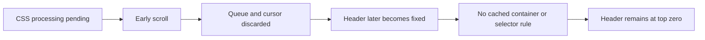

# Gecko header scrolling and narrow sidebars

Investigation: 2026-10-05. Current shared Candy Edge prototype with event-driven known-header
top tracking. The reported GitHub screenshots show both the normal header and opened navigation
under status icons; Lidl shows its returning header under the icons while partially scrolled.

## Evidence and limits

| Check | Observation | Scope |
| --- | --- | --- |
| Live Lidl DOM at mobile width 412 | `.n-navigation__top-menu-animator` starts `relative`; upward scrolling adds `n-navigation__sticky-top-menu`, changes it to `fixed; top: 0`, and reveals it through a transform | Current public site in isolated Chromium, not a Gecko device acceptance test |
| Shared prototype injected into that page with a simulated 32-CSS-pixel inset | With completed CSS processing the returning header has top/Y 32; interrupting processing by scrolling leaves top/Y 0 | Actual site CSS plus the shared production JS; native fallback and Gecko insets are not simulated completely |
| Failed live-page state | `active=true`, `cssRulesApplied=0`, `cssScrollCancellations=1`, no pending jobs, no CSS security errors or budget hits | Confirms the cancellation path can produce the observed Lidl geometry |
| Controlled Lidl-selector reproduction | Without interruption: top 32, one protected selector. Early scroll: top 0, zero protected selectors; a later quiet period does not resume processing | Deterministic Node fixture using the actual selector/state names |
| GitHub's public Primer CSS | A left sidebar uses fixed positioning, height 100%, and `inset: 0 auto 0 0` | Matches the reported sidebar's shape; authenticated page DOM was not inspected |
| Controlled narrow navigation panel | Width 320 in viewport 800, top/bottom 0; shared prototype leaves top 0 | Demonstrates the existing bottom-anchor exclusion also rejects sidebars |
| Pixel one-shot probe after restarting the diagnostic build | Non-cover page, policy ready/enabled, native top 172 px, renderer inset 77.4 CSS px, body padding 77.4, native margin 0; 39 CSS sources, 7 applied selectors, one scroll cancellation, no CSS security errors or budget hits | Restored Lidl page at scroll zero; header flow is safe in this snapshot. It does not capture the reported returning-header failure or GitHub header. No profiler recording was started. |
| Pixel GitHub snapshot in the reported state | At scroll zero: viewport-wide `HEADER`, static position, Y 0, height 64, computed top unresolved, padding 0; body static with padding 0. Policy ready/enabled with native inset 172 px (77.4 CSS px), native margin 0. No containing-block effects on the sampled header/ancestor chain. CSS counters: 89 sources, zero applied selectors, one cancellation, no security errors or budget hits | Confirms normal-flow header overlap with active policy; the probe does not expose author selectors or owned-rule identities, so the reason body padding fails to apply is not established |

Sources downloaded directly from the current sites:

- [Lidl navigation CSS](https://www.lidl.de/n/navigation/navigation-7b4bd0ac4b538f4315ed35e7f1b00034.css)
- [GitHub Primer CSS](https://github.githubassets.com/assets/primer-4136ede8b2650a2d.css)

## Causes and proposed changes

| Cause | Owning code | Small change to evaluate |
| --- | --- | --- |
| Scroll permanently discards unfinished CSS coverage | `content_safe_area_prototype.js`: `cancel`, `scroll`, `startSelectorScan` | Preserve the bounded CSS queue, cursor, discovery and staged build when scrolling; pause execution and resume after scroll quiet. Policy resets still clear them. Do not restart completed work or scan per scroll event. |
| Initially relative wrappers are not in the known-header top cache | `rememberTopCandidate`, `seedSemanticHeaders`, `queueHeaderTopMutations` | Retain a bounded set of relevant positioning containers and invalidate the actual container on its class/style change. Existing semantic children alone do not represent its positioning. |
| Fixed top/bottom panels are classified as bottom navigation | `classify`, `isViewportFixedOverlay`, `isViewportModalSurface` | Admit visible top-anchored navigation/dialog sidebars by their role and geometry, keeping bottom bars and backdrop surfaces excluded. Keep the bottom anchor; protect content without creating bottom overflow. |

Two additional controlled gaps were found: a static ancestor becoming sticky/fixed can be skipped
when only its semantic child is cached; a cover-page sticky header initially below the inset can
later clamp to top zero without a DOM mutation. These are distinct from the verified non-cover
Lidl CSS-cancellation reproduction. A current rectangle or child position does not prove a safe
future sticky clamp.

The authenticated GitHub snapshot confirms an unsafe normal-flow header with active policy.
`requestNativeFallbackForHeader` currently excludes every position except fixed/sticky, so this
header cannot request native top protection. A bounded fallback for a visible primary normal-flow
header whose controls overlap the safe band at scroll zero is a suitable extension to evaluate.
The tag and missing top declaration alone are not sufficient: secondary article headers and
headers already protected through parent/header padding must retain their existing layout.
The public logged-out header differs from the screenshot. The known-header top refresh in this
worktree covers cached headers whose author top changes, but it does not resolve the CSS-scan,
relative-wrapper, sidebar or normal-flow-header gaps above. No production fix for those gaps was
made during this investigation.
