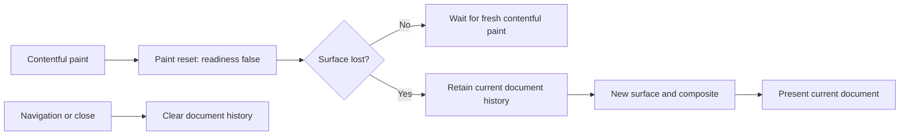
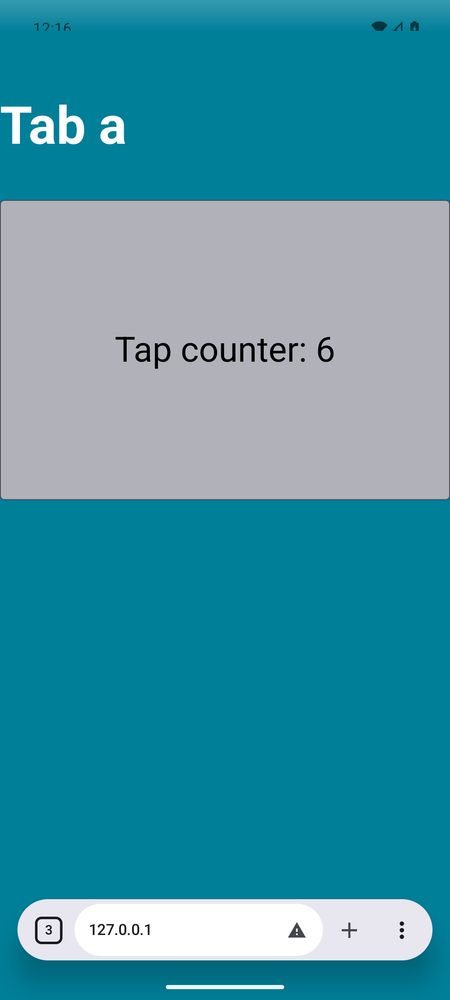
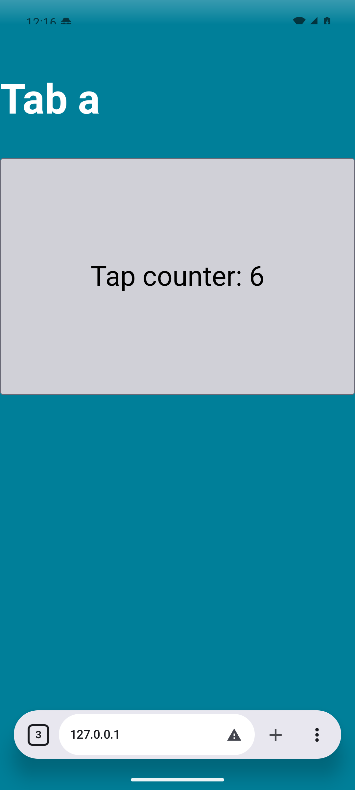
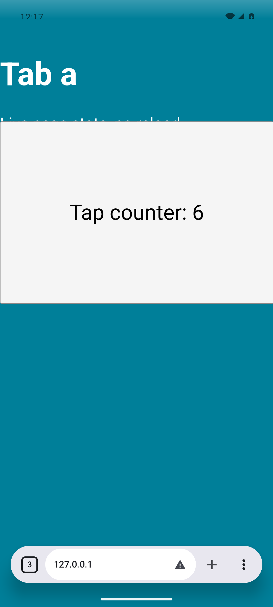

# Gecko tab paint-reset recovery

| Scope | Evidence or limit |
| --- | --- |
| Report | [Issue 257](https://github.com/sk2andy/candy-browser/issues/257): Nothing Phone 2a, Android 16, Gecko page freezes after A → B → A |
| Related fix | Issue 258's retained-document recovery is already on main before this follow-up |
| Local device | Dedicated `codex_issue257_root`, Android 16 / API 36, `emulator-5616` |
| Native fixture | Real local HTTP counter/color pages, injected touchscreen input and actual screenshot pixels |
| Original-device boundary | Nothing Phone 2a firmware and its original callback timeline were not independently tested |
| Attribution | Natural API-36 tab/resume tests also passed before this follow-up. The verified defect is the presentation gate's reset-before-surface-loss ordering; this is not proof of the original device's cause. |

## Presentation policy

`GeckoContentPresentationGate` separates the current surface's paint readiness from whether the current document has ever painted. A paint reset invalidates readiness but does not replace the document. Surface loss can therefore retain that document's paint history even when reset arrived first. A replacement surface still needs a new composite before the preview handoff releases. Navigation and close discard the document history.

| Signal order | Required result |
| --- | --- |
| Contentful paint → reset → detach → replacement surface → composite | Reuse current document; release presentation waiter |
| Contentful paint → reset → destroy, repeated | Recover each replacement surface after its own composite |
| Contentful paint → reset → navigation → detach → composite | Keep new document blocked until its own contentful paint |
| Reset on a continuously visible surface | Keep readiness blocked until fresh contentful paint |

The previous tab is marked inactive before Compose releases its renderer. Gecko callbacks and Android surface callbacks are separate signals, so the gate must support both reset/surface-loss orders. The regression tests establish this policy defect directly; they do not establish an OEM callback timeline.

## Verification

Native runs and screenshots used commit `71835a8f`. A later test-only change adds the existing `SYSTEM_WEBVIEW_ONLY` skip pattern to the two Gecko methods; normal Full/Foss test bodies and production code are unchanged. Final CI compilation validates those guards. No additional device run at the guard commit is claimed.

| Check | Before | After |
| --- | --- | --- |
| Original gate + first regression, Gradle FullDebug | 14/15 pass; reset-before-detach fails | 21/21 gate tests pass in both Full/Foss |
| Main with issue 258 + all three new regressions, Gradle FullDebug | 19/21 pass; reset-before-detach and repeated reset-before-destruction fail | 21/21 pass in both Full/Foss |
| Natural Gecko regular/private and System WebView tab tests | 3/3 pass on API 36; original freeze not reproduced | 3/3 pass with final patch |
| Main background-resume compatibility tests (separate run) | Not rerun before fix | 3/3 pass on API 36 |
| Full/Foss unit suites | Not run in full before fix | 1,794/1,794 pass per variant |
| Full/Foss lint and debug assemblies | Not run before fix | Both lint tasks and assemblies pass |
| Independent production/test review | — | No blocking finding |

| Native tab acceptance | Assertion |
| --- | --- |
| Repeated switching | Four B → A returns; A/B sessions retain identity |
| Input and live output | Actual taps advance titles and alternate visible page colors |
| Resume | 31 seconds with Activity stopped, followed by another actual tap |
| Preserved state | Final counters A=6, B=4; exactly two document requests, no reload |
| Background state | Gecko reports inactive tab hidden and selected tab visible |
| Private storage | Raw persisted tab metadata excludes fixture URLs/IDs; opaque native snapshots absent before and after Activity close |

These screenshots come from the final native tab tests on the dedicated API-36 emulator. Each shows A's sixth actual tap after four tab returns and the background interval. The fixture is synthetic; the Candy app, native engine, inputs and displayed pixels are real. The passing natural baseline remains a compatibility control rather than a claimed freeze reproduction.

| Gecko regular | Gecko private | System WebView |
| --- | --- | --- |
|  |  |  |
