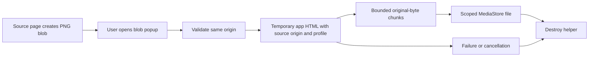

# Issue 248: System WebView blob downloads and CSP

## Scope and live evidence

| Evidence | Result |
| --- | --- |
| Issue attachment filename | Ends in `dev.sk2andy.materialbrowser.systemwebview.jpg`; no readable image was attached |
| User's local Gecko test | Download works; no Gecko change is included |
| Dedicated Android emulator | Android 16 / API 36, System WebView `133.0.6943.137` |
| Signed Candy System WebView release | Version 0.45.1, official APK checksum verified |
| Gemini free, signed out | Submitted a request for a red circle on a white background; Gemini answered that image creation requires signing in |
| User-authorized Pixel 11 Pro | Android 17 / API 37, System WebView `153.0.8010.36`; auto-rotate remained disabled |
| Installed regular Candy on Pixel | Version 0.45.1 with System WebView selected; existing Google login retained |
| Gemini free, signed in on Pixel | Gemini Flash generated an image; the user repeatedly reproduced the download-button snackbar, "Download konnte nicht gestartet werden" |
| Patched live Gemini download | Not yet verified in a signed-in session |

The user confirmed a live System WebView download failure. The CSP defect below is independently
proven in a controlled fixture; its relationship to that Gemini failure remains unconfirmed.
Do not treat the fixture as a successful live Gemini acceptance test.

## Pixel diagnostics

| Capture | Finding |
| --- | --- |
| Release-process Logcat, including repeated attempts | No download exception stack trace or concrete transfer failure reason was recorded |
| Temporary WebView `webview-log-js-console-messages` flag | Exposed report-only script CSP warnings and repeated "No ID or name found in config" messages; neither identifies the download failure |
| Android DownloadManager/DownloadProvider tags | No matching diagnostic records |
| Shared download response callback | `startBuiltInDownloadResponse` discards `onFailed(reason)` and displays the generic snackbar |
| Blob JavaScript | Catches exceptions and sends a generic bridge error without the exception details |

The existing release logs cannot distinguish an invalid request, blob fetch failure, storage
failure or timeout. A report-only script CSP warning is not evidence of a blocked blob fetch.
Console capture followed the [documented WebView flag workflow](https://developer.android.com/develop/ui/views/layout/webapps/debug-javascript-console-logs).
The flag and the notification permission required by DevTools were returned to their prior states.

## Controlled reproduction

| Scenario on unchanged production code | Result |
| --- | --- |
| Genuine touch opens a same-origin PNG blob popup without CSP | Download completes |
| Same popup with `connect-src 'self'` | Transfer reports `Network`; Chromium logs a CSP refusal for `fetch(blob:...)` |
| App-owned HTML, same origin and default profile | The original PNG can be read from another WebView |

The fixture uses a valid 2-by-1 PNG with a red and green pixel. Assertions check the exact bytes,
decoded dimensions and colors, stored MIME type, extension, and completed MediaStore row.
The popup regression uses a real touch and the production popup/download routing.

`connect-src 'self'` does not authorize a `blob:` fetch from an HTTPS/HTTP document. Candy's injected
JavaScript previously inherited that restriction. The website can display or open its image while
Candy's native transfer fails. See the [CSP source matching rules](https://www.w3.org/TR/CSP/#match-url-to-source-expression).

## Transfer ownership

The helper copies the exact source profile before any settings or navigation. Profile lookup errors
fail the transfer rather than falling back to the default profile. It blocks network, file and
content access and executes only app-owned HTML and transfer JavaScript. The source page's CSP is
unchanged. Native messages retain origin, main-frame, helper-identity, token and sequence checks;
existing size, chunk, timeout, cancellation and storage rules remain in force.

Helper cleanup runs on the main thread on every terminal outcome. `close()` destroys all live
helpers synchronously, including terminal operations awaiting posted cleanup. Repeated cleanup
is idempotent. Tests inspect real WebView destruction directly: loaded profiles cannot be assumed
immediately deletable by [ProfileStore](https://developer.android.com/reference/androidx/webkit/ProfileStore#deleteProfile(java.lang.String)).

## Verification

| Check | Coverage |
| --- | --- |
| `SystemWebViewBlobDownloadInstrumentedTest` | Native popup, CSP popup, private popup, original PNG, isolated source profile, foreign-profile refusal, revoked URL, pending storage cancellation, synchronous isolated/private helper close |
| User-authorized Pixel, API 37 / WebView 153.0.8010.36 | All 11 instrumented tests passed in the separate `systemwebview.issue248` test app; this validates controlled transfers, not patched live Gemini |
| `testFullDebugUnitTest`, `testFossDebugUnitTest` | Shared Android/JVM regressions |
| `lintSystemwebviewDebug` | Android/WebView contracts |
| `assembleSystemwebviewDebug`, `assembleSystemwebviewDebugAndroidTest` | APK and instrumentation compilation |
| Manual controlled-page download | Candy's Downloads screen shows `download.png`, Finished, 72 B / 72 B |

Run device tests only on the session's dedicated emulator, or on a physical device explicitly
selected by the user; always use its explicit ADB serial.
Verify the patched Gemini download with a signed-in free account before marking issue 248 resolved.
