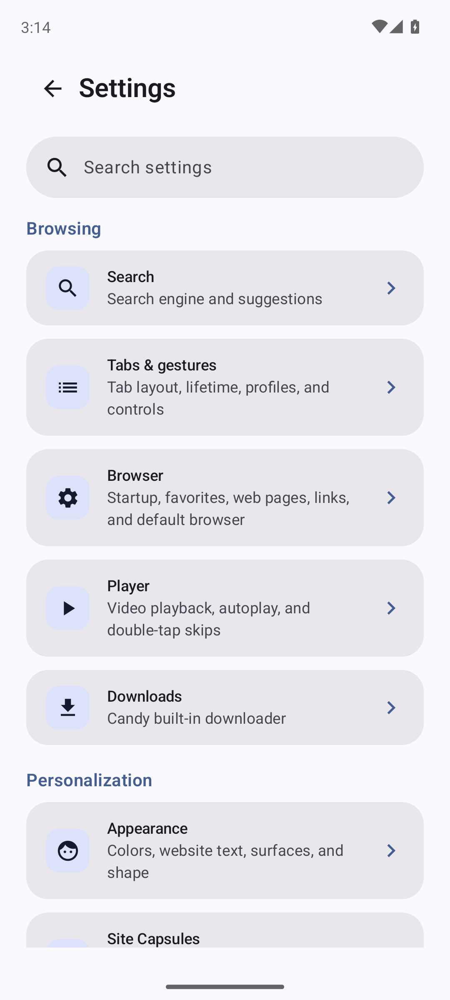
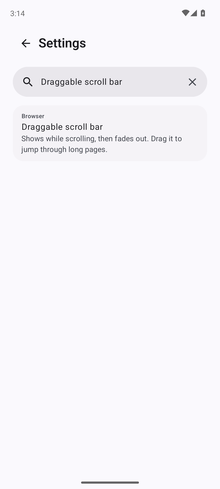
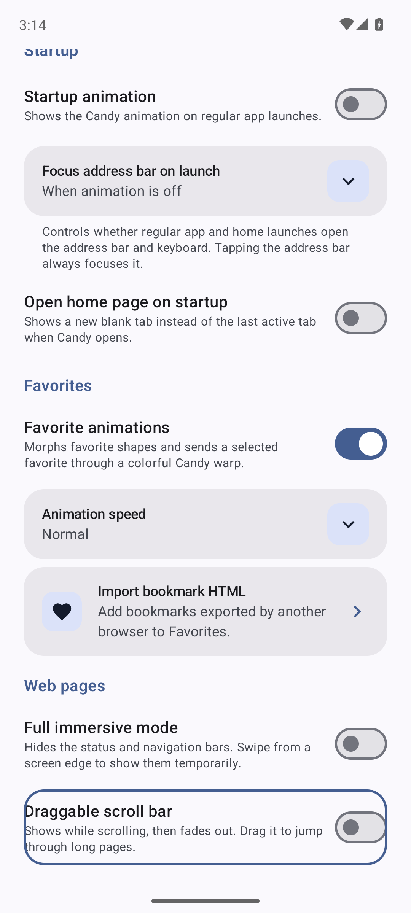

# Issue 253: settings search

| Source | Scope |
| --- | --- |
| [Issue 253](https://github.com/sk2andy/candy-browser/issues/253) | Find individual settings from Settings Home and open the matching control. |
| [PR 261](https://github.com/sk2andy/candy-browser/pull/261) | Localized, capability-filtered search using existing settings routes. |
| Baseline | Feature request; Settings Home had category navigation but no search. No failing pre-change device regression is claimed. |
| Device | Dedicated `codex_issue253_root`, `emulator-5674`, Android 14 / API 34, English resources. |

## Acceptance

| Contract | Evidence |
| --- | --- |
| Localized matching | Pure rules test titles, descriptions, context, case, accents, all query words, ranking and stable ties. Localization script checks resource coverage. |
| Available controls only | Pure catalog tests cover flavor/engine capabilities, unlocked developer options, appearance, search suggestions and download managers. |
| Choices discoverable | Device search finds AMOLED and DuckDuckGo choices. |
| Existing routes and visible targets | Device search opens Browser scrollbar and deep tab-dismiss-resistance control without manual scrolling. Scrollbar remains interactive and persists through the existing controller. |
| Back and keyboard | Device tests cover clear, no results, header/system Back, return to query and keyboard/focus dismissal. |
| Private search | Real private-tab device test verifies the 200-character limit, absence from session preferences and discarded query after Activity recreation. |
| Existing navigation | Existing Player navigation regression exercises the shared home and page shell. |

## Initial feature validation

| Check | Result |
| --- | --- |
| Full unit suite | 1,805 passed; zero failures, errors or skipped. |
| Foss unit suite | 1,805 passed; zero failures, errors or skipped. |
| New rules/catalog tests | 6 rules + 8 catalog tests passed in each variant. |
| Full/Foss lint and debug assembly | Passed. |
| Full instrumentation APK assembly | Passed. |
| Dedicated API 34 MainActivity instrumentation | 6 passed in 69.327 seconds; zero skipped. |
| Localization script | 2 passed; search strings cover all 28 declared locales. |
| Independent code/style review | No remaining blocking findings after focus/navigation and custom-control coverage corrections. |
| Safe-area and Google Cast CI | Required workflows are tracked in [PR 261 checks](https://github.com/sk2andy/candy-browser/pull/261/checks); merge requires both to pass on the final PR head. |

Combined local validation used main commit `affa9d23` with feature/test snapshot `5b969968`. Local Gradle validation used `testFullDebugUnitTest testFossDebugUnitTest lintFullDebug lintFossDebug assembleFullDebug assembleFossDebug assembleFullDebugAndroidTest`, with two workers and Kotlin compilation in process. Device validation installed the resulting APKs and ran `SettingsSearchInstrumentedTest` plus `PlayerSettingsNavigationInstrumentedTest` through the AndroidJUnitRunner, with explicit `ANDROID_SERIAL=emulator-5674` and `adb -s emulator-5674`. The emulator and shared host lock were released after validation.

Runtime coverage uses the English API 34 emulator. Other locales receive structural resource validation and pure matching coverage; physical devices and every locale/engine combination are not runtime-verified.

## Material 3 presentation follow-up

The [Material search specification](https://m3.material.io/components/search/specs) calls for a filled search bar and a list of results. [PR 269](https://github.com/sk2andy/candy-browser/pull/269) replaces the outlined input and separate cards with native Material 3 `SearchBar`, `SearchBarDefaults.InputField` and `ListItem` rows in one shared container. It follows the existing History/Downloads inline-search pattern; matching, routes and ephemeral query ownership stay unchanged.

| Check | Result |
| --- | --- |
| Integration | Main `485f1d05` with presentation/test snapshot `672c3153`. |
| Full/Foss unit suites | 1,824 passed each; zero failures, errors or skipped. |
| Full/Foss lint and debug assembly | Passed. |
| Full instrumentation APK assembly | Passed. |
| Dedicated API 34 MainActivity instrumentation | 6 passed in 65.196 seconds; zero skipped. |
| Native search geometry | Instrumentation verifies the input is 56 dp high and shows the localized inline placeholder. |
| Independent API/style/test review | No blocking findings; resolved Material 3 version is `1.4.0-alpha08`, no dependency change. |
| Required CI | Final-head safe-area and Google Cast checks tracked in [PR 269](https://github.com/sk2andy/candy-browser/pull/269/checks). |

The source-head Cast CI initially timed out in the existing Gecko video test with no native video tracks. The unchanged failed job passed on one rerun. No Cast code or CI requirement was changed; the exact timing cause was not established.

The same two-worker Gradle checks and explicit dedicated-device runner listed above were used. Runtime coverage remains English/API 34; this correction adds no translations. The emulator and own host lock were released after the run.

## Captured UI

The images below are from the latest Material presentation MainActivity instrumentation: collapsed search bar, results after Search IME, and the opened matching control. Files are copied byte-for-byte from the emulator; they are not mockups.

